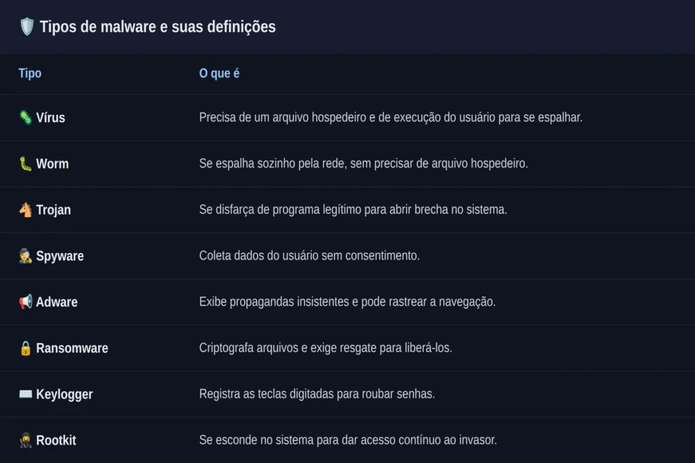
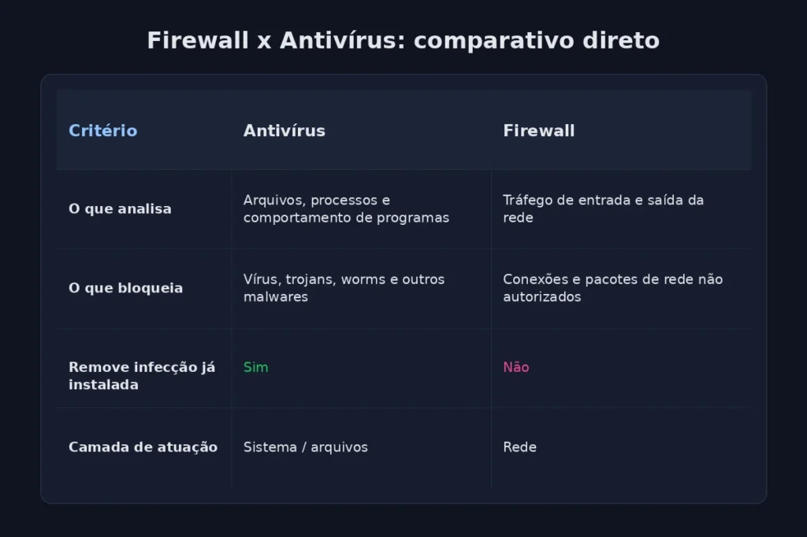
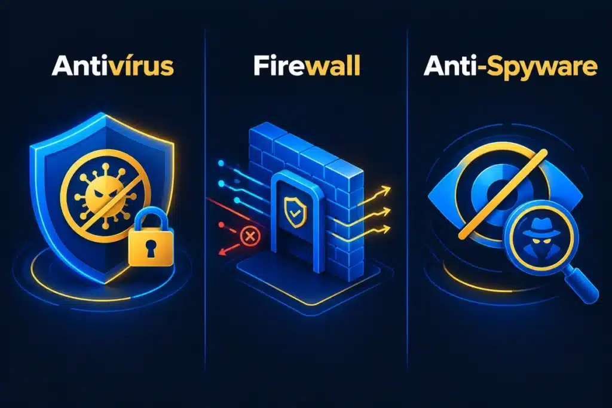

## Introdução

Primeiramente, se você estuda para concurso já percebeu: a banca não pergunta apenas “o que é antivírus”. Ela troca as peças, afirma que o firewall “elimina vírus” ou que o anti-spyware “substitui o antivírus”, e espera que você caia na armadilha.

Por isso, dominar os aplicativos de segurança vai muito além de decorar uma definição solta. Você precisa saber, com segurança, onde termina a função de cada ferramenta e onde começa a próxima.

Nesta aula, você vai entender como antivírus, firewall e anti-spyware se complementam, quais são os limites de cada um e onde normalmente aparece a <strong class="cai-prova">pegadinha</strong> na hora da prova.

## O que são aplicativos de segurança e por que atuam em camadas

Inicialmente, aplicativos de segurança são os programas que detectam, bloqueiam, removem ou reduzem riscos no ambiente digital. Nenhum deles, sozinho, resolve todos os problemas.

Em outras palavras, cada ferramenta atua em uma camada diferente da proteção. Um antivírus cuida de arquivos infectados, um firewall cuida do tráfego de rede, e um anti-spyware cuida de programas espiões. Juntas, essas camadas formam a defesa completa de um sistema.

Cabe destacar, ainda, que a atualização constante faz parte da proteção. Como novas ameaças surgem todos os dias, os fabricantes lançam assinaturas, regras e correções com frequência, e um software desatualizado perde eficácia rapidamente.

Guarde esta ideia: a banca costuma testar exatamente essa lógica de camadas, cobrando se você sabe separar a função de uma ferramenta da função da outra.

### Antivírus: como funciona e onde mora a <strong class="cai-prova">pegadinha</strong>

Para começar, o antivírus é o aplicativo responsável por identificar, bloquear e remover [malware](/malwares-e-ameacas-seguranca-da-informacao/), entre eles vírus, worms, trojans e outras pragas digitais. Ele reconhece essas ameaças por três caminhos principais.

### Tipos de malware mais cobrados em prova

Antes de entrar nas técnicas de detecção, vale ter à mão a definição de cada praga digital, porque a banca gosta de trocar um tipo pelo outro na hora da questão.

## Como o antivírus detecta uma ameaça

Na sequência, veja as três técnicas mais cobradas em prova:

-   **Assinatura**: compara o arquivo com um banco de dados de ameaças já conhecidas.
-   **Heurística**: analisa características do código para prever se ele é malicioso, mesmo sem assinatura cadastrada.
-   **Comportamento**: observa as ações do programa em execução e bloqueia atitudes suspeitas, como criptografar arquivos em massa.

Além disso, o **antivírus** depende de atualização frequente para reconhecer variantes novas. A **Microsoft** explica que o **Windows Security** mantém uma inteligência de segurança justamente para identificar ameaças recentes que podem infectar o dispositivo.

### Os limites do antivírus

No entanto, antivírus nenhum garante proteção absoluta. Ele reduz o risco de infecção, mas não impede todo tipo de ataque, principalmente quando o próprio usuário executa um arquivo suspeito ou ignora um alerta de segurança.

Esse é um detalhe que costuma confundir o candidato: a banca gosta de transformar “reduz o risco” em “elimina totalmente o risco”, e essa troca de palavras já torna a alternativa errada.

### Firewall: o filtro de tráfego que não remove vírus

Em seguida, o **firewall** controla o tráfego de rede a partir de regras de segurança. Ele decide, com base nessas regras, quais conexões de entrada e de saída podem passar.

Da mesma forma que o antivírus, o firewall existe tanto em software quanto em hardware, e funciona como uma barreira entre uma rede confiável e uma rede externa.

### Diferença entre firewall e antivírus: o que a banca mais cobra

Portanto, não confunda as duas ferramentas. A diferença central está no alvo de atuação: o antivírus trabalha dentro do sistema, analisando arquivos e processos, enquanto o firewall trabalha na borda da rede, analisando conexões antes mesmo que cheguem ao sistema. O firewall filtra tráfego e controla acesso; ele não identifica nem remove malware. Quem cumpre esse papel é o antivírus.

Na prática, o antivírus entra em ação quando você abre por engano um arquivo contaminado, e o firewall barra uma tentativa de acesso indevido vinda de fora, antes mesmo de qualquer arquivo chegar ao sistema.

Na prova, quando você encontrar uma questão dizendo que o firewall “elimina vírus” ou “remove trojans do disco”, desconfie: essa afirmação, isoladamente, já indica erro na maioria das bancas. O mesmo vale para o contrário: se a questão disser que o antivírus “controla o tráfego de rede”, a troca de funções também está errada.

Lembre-se, por fim, de que as duas ferramentas trabalham juntas, e não uma no lugar da outra. Um computador seguro normalmente usa firewall e antivírus ao mesmo tempo, cada um cobrindo uma camada diferente da proteção.

### Anti-spyware e antimalware: abrangência específica x abrangência geral

Além disso, o **anti-spyware** detecta e remove programas espiões, aqueles que coletam dados do usuário sem consentimento. Em geral, ele atua de forma mais especializada contra esse tipo específico de ameaça.

Já o **antimalware** carrega um sentido mais amplo. Esse termo se refere a qualquer ferramenta capaz de detectar e responder a diferentes tipos de software malicioso, o que inclui vírus, spyware, adware e trojans na mesma frente de proteção.

Não confunda os dois conceitos: todo anti-spyware pode ser chamado de antimalware, mas nem todo antimalware tem o spyware como alvo específico. Por esse motivo, muitos pacotes de segurança reúnem antivírus, anti-spyware e outros recursos em uma única suíte.

## Outras ferramentas que completam a proteção

Principalmente na rotina de um usuário, outras ferramentas também reforçam a segurança do ambiente digital:

-   **Backup**: cria [cópias de segurança](/backup-seguranca-da-informacao/) para recuperar dados após um ataque ou uma falha.
-   **VPN**: protege o tráfego de dados em redes públicas.
-   **Gerenciador de senhas**: ajuda a criar e armazenar senhas fortes.
-   **Autenticação multifator**: adiciona uma segunda camada de verificação no acesso.
-   **Filtro antispam**: reduz mensagens indesejadas e maliciosas na caixa de entrada.

Aqui está um ponto que merece atenção: para memorizar a lógica do backup, vale guardar a **[regra 3-2-1](/regra-3-2-1/)**, um dos critérios mais cobrados quando a banca pergunta sobre cópias de segurança.

Consequentemente, essas soluções não substituem o antivírus nem o firewall. Elas complementam a proteção geral, cada uma resolvendo uma fragilidade que as outras não cobrem sozinhas.

### O que mais cai em concursos sobre aplicativos de segurança

Em resumo, as bancas costumam cobrar três funções centrais: o antivírus protege contra malware, o firewall controla o tráfego de rede, e o anti-spyware combate programas espiões.

Não apenas isso, também aparecem <strong class="cai-prova">pegadinhas</strong> sobre atualização, sobre abrangência da proteção e sobre a diferença entre prevenção e remoção. Sempre que a questão afirmar que uma ferramenta “garante” ou “elimina totalmente” algum risco, vale desconfiar.

## Perguntas frequentes

### Qual a diferença entre antivírus e firewall?

_O **antivírus** identifica, bloqueia e remove malware, como vírus e trojans. Já o **firewall** controla o tráfego de rede, permitindo ou bloqueando conexões conforme regras de segurança. Um não substitui o outro: eles atuam em camadas diferentes da proteção._

### O anti-spyware substitui o antivírus?

_Não. O **anti-spyware** é especializado em detectar e remover programas espiões, enquanto o antivírus cobre uma gama mais ampla de malware. Por isso, muitas suítes de segurança reúnem as duas funções no mesmo pacote._

### O firewall consegue remover um vírus já instalado no computador?

_Não. O firewall filtra o tráfego de entrada e saída da rede, mas não analisa nem remove arquivos infectados. Essa tarefa cabe ao antivírus._

### Antimalware e antivírus são a mesma coisa?

_Não exatamente. O antivírus é um tipo específico de proteção contra vírus e ameaças semelhantes, enquanto o **antimalware** é um termo mais amplo, que engloba a detecção de vírus, spyware, adware e outras pragas digitais._

### Ter antivírus é suficiente para estar protegido?

_Não. O antivírus reduz o risco de infecção, mas não substitui firewall, backup, boas senhas e autenticação multifator. A proteção completa depende da combinação dessas camadas._

## Conclusão

Por fim, os aplicativos de segurança formam uma rede de proteção em camadas, e cada um assume uma responsabilidade diferente dentro dessa rede. O **antivírus** cuida do malware, o **firewall** cuida do tráfego, e o **anti-spyware** cuida da espionagem digital.

Portanto, revise as funções de cada ferramenta, treine as <strong class="cai-prova">pegadinhas</strong> mais comuns e teste o que você aprendeu no [simulado de segurança da informação](/simulado-seguranca-da-informacao/) para chegar mais seguro na sua prova.

## Fontes e referências

-   NIST Computer Security Resource Center. [Firewall – Glossary](https://csrc.nist.gov/glossary/term/firewall)
-   NIST Computer Security Resource Center. [Malware – Glossary](https://csrc.nist.gov/glossary/term/malware)
-   Microsoft. [Virus and Threat Protection in the Windows Security App](https://support.microsoft.com/en-us/windows/security/threat-malware-protection/virus-and-threat-protection-in-the-windows-security-app)

-   
    
    [Cebraspe: como funciona a banca e o que ela cobra em Informática](/cebraspe-como-funciona-a-banca-e-o-que-ela-cobra-em-informatica/)
-   
    
    [Como Estudar para Concurso Faltando Menos de 15 Dias para a Prova](/como-estudar-para-concurso/)
-   
    
    [Informática para concursos: 5 confusões clássicas e como a banca as cobra](/informatica-para-concursos-5-duvidas-prova/)
-   
    
    [10 dicas para gabaritar a prova de Informática da Cebraspe PM MA 2026](/informatica-cebraspe-pm-ma-2026/)
-   
    
    [Windows 10: Guia Completo para Concursos Públicos](/windows-10-para-concursos/)
