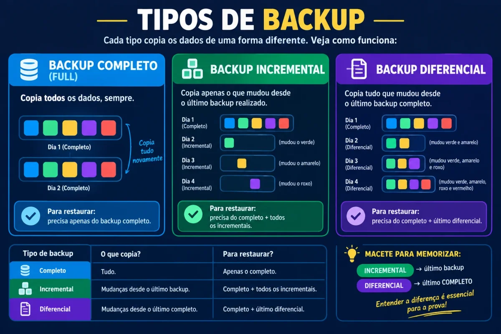

## Introdução à cópia de segurança

Primeiramente, a **cópia de segurança** é um recurso essencial para proteger dados, arquivos, sistemas e configurações importantes. Ela permite recuperar informações após falhas técnicas, exclusões acidentais, ataques cibernéticos ou desastres físicos.

Além disso, esse tema aparece com frequência em concursos públicos porque envolve disponibilidade, continuidade operacional e recuperação de dados. As bancas costumam cobrar definição, tipos, boas práticas e diferenças entre os modelos de proteção.

Nesta aula, você vai entender o conceito, revisar os principais tipos e resolver questões de nível intermediário.

## O que é backup?

Inicialmente, backup é o processo de criar cópias planejadas e regulares de informações relevantes para permitir sua restauração futura. O objetivo não é apenas duplicar arquivos, mas garantir recuperação quando o conteúdo original se perder, for corrompido ou ficar inacessível.

Em outras palavras, não basta copiar documentos para a mesma unidade de armazenamento e chamar isso de proteção. Se o equipamento falhar, sofrer um incidente ou for atingido por [malware](/malwares-e-ameacas-seguranca-da-informacao/), a cópia local pode ser perdida junto com os arquivos originais.

Por isso, uma estratégia eficiente precisa considerar local de armazenamento, periodicidade, retenção e teste de restauração.

## Tipos de backup

Em seguida, o candidato precisa dominar os tipos mais cobrados em prova: completo, incremental e diferencial. As bancas costumam inverter conceitos ou trocar vantagens e desvantagens entre eles.

## Backup completo

Primeiramente, o **backup completo** copia todos os arquivos selecionados, independentemente de terem mudado ou não desde a última execução. Esse modelo cria uma imagem integral do conjunto de dados naquele momento.

Por esse motivo, a execução tende a ser mais lenta e exige mais espaço de armazenamento. Por outro lado, a restauração fica mais simples, porque normalmente basta recuperar um único conjunto de cópia.

## Backup incremental

Em seguida, o **backup incremental** copia apenas os arquivos criados ou alterados desde o último procedimento realizado, seja ele completo ou incremental. Isso reduz o volume copiado a cada nova execução.

Como resultado, essa modalidade costuma ser mais rápida no dia a dia e consome menos espaço. No entanto, a restauração é mais trabalhosa, pois exige o último backup completo e todos os incrementais posteriores.

## Backup diferencial

Por outro lado, o **backup diferencial** copia todos os arquivos alterados desde o último backup completo. Ele não usa como base o último diferencial, mas sempre o último full.

Dessa forma, o volume copiado cresce com o passar dos dias, porque acumula todas as alterações desde a última cópia integral. Ainda assim, a recuperação fica mais simples, já que normalmente exige apenas o último completo e o último diferencial.

## Comparação entre os tipos

A seguir, veja uma comparação objetiva entre os modelos mais cobrados:

| Tipo de backup | O que copia | Velocidade de execução | Facilidade de restauração |
| --- | --- | --- | --- |
| Completo | Todos os arquivos selecionados | Mais lenta | Mais simples |
| Incremental | Apenas o que mudou desde o último procedimento | Mais rápida | Mais complexa, pois exige cadeia de cópias |
| Diferencial | Tudo o que mudou desde o último completo | Intermediária, mas cresce com o tempo | Mais simples que a incremental |

## Boas práticas de proteção

Além disso, uma estratégia eficiente não depende apenas do tipo de cópia. Ela também depende de práticas de armazenamento, proteção e verificação.

## Regra 3-2-1

Primeiramente, a [regra **3-2-1**](/regra-3-2-1/) recomenda manter três cópias dos dados: uma principal e duas reservas. Essas cópias devem ficar em pelo menos dois tipos de mídia, e uma delas deve permanecer fora do local principal.

Essa prática reduz o risco de perda simultânea por falha física, desastre ambiental ou ataque. Em cenários modernos, muitas organizações ainda ampliam essa lógica com cópias offline ou imutáveis.

## Cópia offline e imutável

Em seguida, a cópia **offline** permanece desconectada da rede quando não está em uso. Já a cópia **imutável** impede alteração ou exclusão durante um período definido.

Por isso, esses modelos ajudam muito na defesa contra [ransomware](/malwares-e-ameacas-seguranca-da-informacao/). Muitos atacantes tentam localizar e destruir as cópias de segurança antes de criptografar os dados principais.

## Teste de restauração

Por fim, a proteção só prova seu valor quando a restauração funciona. Testes periódicos são indispensáveis, porque cópias corrompidas ou incompletas muitas vezes só são descobertas no momento da crise.

## Backup e segurança da informação

Principalmente, a cópia de segurança protege a **disponibilidade** da informação, um dos pilares clássicos da segurança da informação. Quando uma organização restaura dados com rapidez, ela reduz impacto operacional, financeiro e reputacional.

Além disso, essa prática reforça a resiliência contra erro humano, falha de hardware e incidentes de segurança. Em ataques de ransomware, por exemplo, cópias seguras e isoladas podem permitir a retomada do ambiente sem pagamento de resgate.

No entanto, essa medida não substitui outras camadas de proteção. Ela complementa [antivírus](/aplicativos-para-seguranca-antivirus-firewall-antispyware/), controle de acesso, atualização de sistemas, criptografia e monitoramento.

## O que mais cai em concursos

Vale destacar alguns pontos que as bancas cobram com insistência:

-   Cópia completa guarda tudo.
-   Cópia incremental guarda apenas o que mudou desde o último procedimento.
-   Cópia diferencial guarda o que mudou desde o último completo.

Além disso, as provas exploram bastante a lógica da restauração. A incremental economiza tempo na cópia diária, mas complica a recuperação; a diferencial ocupa mais espaço com o passar do tempo, mas simplifica a restauração.

Por esse motivo, o candidato precisa memorizar não só a definição, mas também o comportamento de cada modelo em cenários práticos.

## Conclusão

Portanto, estudar **backup** para concursos públicos exige mais do que decorar definições. O candidato precisa entender como cada tipo funciona, como ocorre a restauração e por que boas práticas como a regra 3-2-1 e os testes periódicos fazem tanta diferença.

Por fim, revise os conceitos de completo, incremental e diferencial, compare suas vantagens e treine [questões contextualizadas](/simulado-seguranca-da-informacao/). Esse é o caminho mais seguro para acertar as pegadinhas de prova sobre segurança da informação.

## Fontes e Referências

-   [Veeam. 3-2-1 Backup Rule Explained: Do I Need One?](https://www.veeam.com/blog/321-backup-rule.html)
-   [BackupRadar. Backup: Definition, Strategy and Legal Basis](https://www.backupradar.com/backup-definition-strategy-legal-basis/)
-   [Kapa Cyber. Backup Strategies That Survive Ransomware (3-2-1 Rule)](https://kapacyber.com/insights/ransomware-backup-strategy-321)
-   [Bare Metal Cyber. Backup and Recovery Methods — GFS, 3-2-1, Testing](https://baremetalcyber.com/backup-recovery-methods-gfs-321-testing/)
-   [Qconcursos. Questões sobre backup diferencial e incremental](https://www.qconcursos.com/questoes-de-concursos/questoes/sobre/backup-diferencial-e-incremental)

-   
    
    [Cebraspe: como funciona a banca e o que ela cobra em Informática](/cebraspe-como-funciona-a-banca-e-o-que-ela-cobra-em-informatica/)
-   
    
    [Como Estudar para Concurso Faltando Menos de 15 Dias para a Prova](/como-estudar-para-concurso/)
-   
    
    [Informática para concursos: 5 confusões clássicas e como a banca as cobra](/informatica-para-concursos-5-duvidas-prova/)
-   
    
    [10 dicas para gabaritar a prova de Informática da Cebraspe PM MA 2026](/informatica-cebraspe-pm-ma-2026/)
-   
    
    [Windows 10: Guia Completo para Concursos Públicos](/windows-10-para-concursos/)
