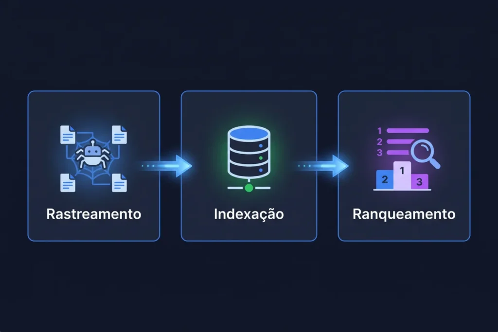

Você abre o navegador, digita uma pergunta na barra de busca e a resposta aparece em segundos. Nesse processo simples, dois elementos distintos entram em ação, e a maioria dos candidatos não sabe separar um do outro.

Essa confusão vira armadilha de prova com frequência. Por isso, você vai entender agora a diferença entre navegador e buscador, com exemplos reais e as <strong class="cai-prova">pegadinhas</strong> que as bancas mais exploram nesse tema.

### O Que É um Navegador de Internet (Browser)

Primeiramente, o navegador é o programa que você instala no computador ou no celular para acessar a internet. Ele interpreta o código das páginas (HTML, CSS e JavaScript) e exibe o resultado na tela, com texto, imagens e vídeos organizados.

Além disso, o navegador funciona como uma janela para a web. Sem ele, o seu dispositivo não consegue abrir sites, redes sociais ou plataformas de streaming pela internet.

Guarde esta ideia: o navegador é a ferramenta de acesso. Ele não sabe, sozinho, onde estão as informações que você procura. Essa é justamente a função do buscador, que você vai ver a seguir.

#### Principais Exemplos de Navegadores

-   Google Chrome (Google)
-   Mozilla Firefox (Mozilla Foundation)
-   Microsoft Edge (Microsoft)
-   Safari (Apple)
-   Opera (Opera Software)
-   Brave (Brave Software)

Repare que cada navegador pertence a uma empresa diferente, mesmo quando o nome da empresa não aparece diretamente no produto.

### O Que É um Buscador (Motor de Busca)

Em seguida, o buscador entra em cena. Ele é um serviço, geralmente acessado por meio de um site, que indexa páginas da internet e organiza os resultados de acordo com a sua pesquisa.

Ou seja, o buscador não é um programa instalado no seu computador. Você o acessa dentro do navegador, digitando o endereço do serviço ou usando a barra de pesquisa integrada.

Esse é um detalhe que costuma confundir o candidato: usar um buscador exige, na prática, um navegador aberto. O contrário não é verdadeiro, já que você abre um navegador sem necessariamente realizar uma busca.

#### Principais Exemplos de Buscadores

-   Google Search
-   Bing (Microsoft)
-   Yahoo Search
-   DuckDuckGo
-   Yandex
-   Baidu

Perceba que o Google aparece duas vezes neste artigo, uma como empresa e outra como buscador. Essa sobreposição de nomes é, aliás, uma das maiores fontes de confusão entre os candidatos.

### Navegador x Buscador: as Diferenças na Prática

A tabela abaixo reúne navegadores populares e o buscador padrão configurado em cada um deles. Use-a como referência rápida antes da prova.

 Tabela: Navegador x Buscador Padrão 

### Navegador x Buscador Padrão: Exemplos Comparativos

  
| Navegador (Browser) | Empresa Desenvolvedora | Buscador Padrão |
| --- | --- | --- |
| Google Chrome | Google | Google |
| Mozilla Firefox | Mozilla Foundation | GooglePode trocar para Bing ou DuckDuckGo |
| Microsoft Edge | Microsoft | Bing |
| Safari | Apple | GooglePor acordo comercial com a Apple |
| Opera | Opera Software | Google |
| Brave | Brave Software | Brave Search |
| Vivaldi | Vivaldi Technologies | GoogleConfigurável pelo usuário |
| Tor Browser | The Tor Project | DuckDuckGo |
| DuckDuckGo Browser | DuckDuckGo, Inc. | DuckDuckGo |
| Yahoo Browser | Yahoo (Verizon Media) | Yahoo SearchDistribuição regional (Ásia) |
| Baidu Browser | Baidu, Inc. | Baidu |
| Samsung Internet | Samsung | Google |
| UC Browser | UCWeb (Alibaba) | Varia por regiãoGoogle, Yahoo ou Bing |

Note, dessa forma, que o navegador é o veículo e o buscador é o serviço de pesquisa que roda dentro dele. Um Chrome sem nenhum buscador configurado continua sendo um navegador funcional, mas praticamente inútil para encontrar conteúdo novo na web.

### O que é um sítio de busca

Nos editais, a banca costuma chamar o Google de **sítio de busca**, e não de “site de busca”. A escolha de palavra não é acaso: na linguagem das bancas, sítio é sinônimo de qualquer página hospedada na internet, seja ela institucional, de comércio eletrônico ou de busca. Um sítio de busca, portanto, é uma página criada para localizar outras páginas a partir de palavras-chave digitadas pelo usuário. Ele não guarda o conteúdo dos sites: apenas indica onde esse conteúdo está. É, na prática, o mesmo conceito de buscador que você viu acima.

Essa ferramenta só existe porque está na internet, de forma aberta, e não dentro de uma rede fechada. Se você ainda confunde esses ambientes, revise a diferença entre [internet, intranet e extranet](/o-que-e-extranet/).

### Como um sítio de busca funciona

Por trás da busca simples existe um processo de três etapas, sempre nesta ordem:

1.  **Rastreamento:** programas chamados robôs (crawlers) percorrem a internet, visitam páginas e seguem os links encontrados nelas.
2.  **Indexação:** o sítio organiza o conteúdo rastreado em um banco de dados gigantesco, para consultá-lo depois com rapidez.
3.  **Ranqueamento:** quando você digita uma palavra-chave, o algoritmo decide, entre milhões de páginas, quais aparecem primeiro.

Esse processo depende da estrutura da internet e dos protocolos que conectam os computadores. Se tiver dúvida sobre como os dados trafegam entre servidores, revise a [aula de redes de computadores para concursos](/redes-de-computadores-para-concursos/).

### Principais sítios de busca cobrados em prova

O **Google** aparece disparado na frente, seguido por **Bing** e **Yahoo**. Provas mais recentes também citam alternativas focadas em privacidade, como o **DuckDuckGo**, que promete não rastrear o histórico do usuário, e o **Ecosia**, que reverte parte da receita em plantio de árvores. Existem ainda os buscadores verticais, voltados a um tipo específico de conteúdo, como o **Google Acadêmico**, direcionado a artigos científicos.

A banca também testa os operadores de pesquisa, como as aspas duplas (termo exato), `site:` (restringe a um domínio) e `filetype:` (filtra por tipo de arquivo). Para treinar cada um com exemplos prontos, veja o artigo sobre [operadores de busca do Google](/operadores-de-busca/).

### Sítios de busca e segurança da informação

Nem todo resultado de busca é confiável. Páginas falsas, criadas para imitar sites legítimos, aparecem entre os resultados com o objetivo de aplicar phishing ou instalar malware, mesmo ocupando as primeiras posições. Desconfie de links com endereço estranho ou sem certificado de segurança e revise os [malwares e ameaças à segurança da informação](/malwares-e-ameacas-seguranca-da-informacao/). Na prova, resultado bem posicionado não é garantia de segurança.

### Por Que essa Confusão é Tão Comum

No dia a dia, muita gente diz “vou entrar no Google” para se referir a abrir o navegador Chrome. Essa fala popular mistura os dois conceitos e reforça o erro na hora da prova.

Além disso, o próprio domínio do Google contribui para a confusão, já que a empresa desenvolve tanto o navegador (Chrome) quanto o buscador mais usado do mundo (Google Search). Poucas empresas ocupam as duas posições ao mesmo tempo.

Por outro lado, quando o navegador é da Microsoft (Edge) e o buscador padrão também é da Microsoft (Bing), a distinção entre navegador e empresa fica mais clara. Comparar exemplos, como na tabela acima, ajuda bastante na fixação do conteúdo.

### Como as Bancas Cobram Esse Tema

As bancas exploram esse assunto com afirmações absolutas, um padrão clássico do Cebraspe. Veja alguns exemplos comentados:

-   “O Google Chrome é o mecanismo de busca mais utilizado do mundo.” Errado. O Google Chrome é um navegador. O mecanismo de busca mais utilizado é o Google Search.
-   “É possível acessar um buscador sem usar um navegador, em qualquer situação.” Errado. Na prática cotidiana de um usuário comum, o buscador é acessado por meio de um navegador ou de um aplicativo que também atua como interface de navegação.
-   “O Bing é o buscador padrão do Microsoft Edge.” Certo. Essa afirmação está tecnicamente correta e ilustra bem a relação entre navegador e buscador padrão.

Na prova, a banca pode explorar justamente essa diferença trocando o nome do navegador pelo nome do buscador, ou vice-versa, dentro da mesma frase. Fique atento a esse tipo de troca.

### Dica de Memorização Para Não Errar na Prova

Memorize esta associação simples: o buscador busca e o navegador navega. Se a questão fala em “programa instalado” ou “acesso a páginas”, o assunto é navegador. Se fala em “pesquisa por palavras-chave” ou “resultados organizados”, o assunto é buscador.

Não confunda os dois conceitos mesmo quando o nome da empresa se repete nos dois papéis, como acontece com o Google. Volte à tabela comparativa sempre que tiver dúvida durante os estudos.

### Conclusão

Em resumo, o navegador é o programa que abre a internet, e o buscador é o serviço que organiza os resultados de uma pesquisa dentro dele. Essa distinção parece simples, mas continua sendo um dos temas mais explorados nas provas de informática para concursos.

Agora que você fixou a diferença entre navegador e buscador, aproveite para revisar a [diferença entre internet, intranet e extranet](/o-que-e-extranet/) e a [aula de redes de computadores](/redes-de-computadores-para-concursos/), já que esses assuntos costumam aparecer ao lado desse tema nas provas.

## Perguntas Frequentes

### O que é um sítio de busca?

_É uma página da internet que localiza outras páginas a partir de palavras-chave. Ele rastreia, indexa e ranqueia o conteúdo, mas não o armazena: apenas indica onde encontrá-lo. Na linguagem das bancas, “sítio” significa qualquer página hospedada na internet._

### Qual a diferença entre navegador e buscador?

_O navegador é o programa que você usa para acessar a internet, como o Chrome ou o Firefox. O buscador é o serviço de pesquisa que você acessa dentro do navegador, como o Google Search ou o Bing._

### O Google é um navegador ou um buscador?

_Depende do produto. O Google Search é um buscador, enquanto o Google Chrome é um navegador. A mesma empresa desenvolve os dois, e essa sobreposição costuma confundir o candidato na hora da prova._

### É possível usar um buscador sem abrir um navegador?

_Na prática do usuário comum, não. Você sempre acessa um buscador por meio de um navegador ou de um aplicativo que também funciona como interface de navegação, mesmo quando esse detalhe não aparece na tela._

### Qual é o buscador padrão do Google Chrome?

_O buscador padrão do Google Chrome é o próprio Google Search. Você pode trocar essa configuração a qualquer momento, mas a maioria dos usuários mantém o padrão de fábrica._

-   
    
    [Cebraspe: como funciona a banca e o que ela cobra em Informática](/cebraspe-como-funciona-a-banca-e-o-que-ela-cobra-em-informatica/)
-   
    
    [Como Estudar para Concurso Faltando Menos de 15 Dias para a Prova](/como-estudar-para-concurso/)
-   
    
    [Informática para concursos: 5 confusões clássicas e como a banca as cobra](/informatica-para-concursos-5-duvidas-prova/)
-   
    
    [10 dicas para gabaritar a prova de Informática da Cebraspe PM MA 2026](/informatica-cebraspe-pm-ma-2026/)
-   
    
    [Windows 10: Guia Completo para Concursos Públicos](/windows-10-para-concursos/)
