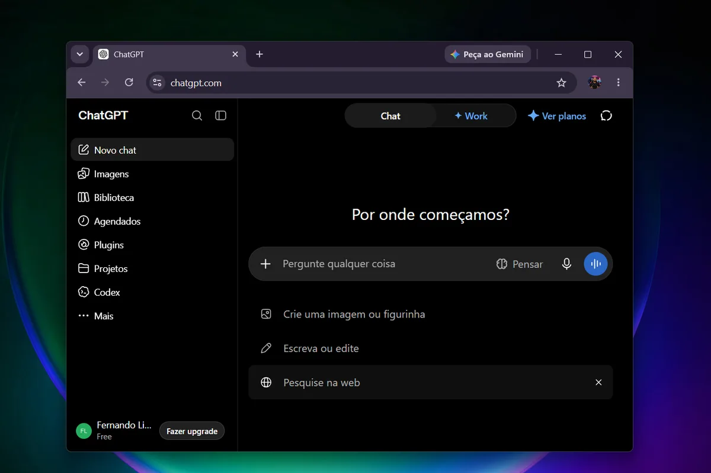

O **ChatGPT** é grátis para quem quer conversar, pesquisar e tirar dúvidas, mas tem planos pagos com mais limites e recursos. No Brasil, o plano Go sai por cerca de R$ 39,99 por mês e o Plus por cerca de R$ 99,99, enquanto o Pro passa de R$ 500. Para a maioria das pessoas, o plano gratuito ou o Go já resolvem.

Abaixo, a comparação entre os planos, o que muda de verdade em cada um e como decidir sem gastar à toa.

## ChatGPT é grátis?

Sim. Basta [criar uma conta e fazer o login](/chatgpt-login/) para usar o plano **Free**, sem cobrança. Ele serve para perguntas do dia a dia, textos, resumos e estudo. O que muda nos planos pagos são os limites: quantas mensagens, imagens e arquivos você pode usar, e o acesso a modelos mais avançados.

Na tela do ChatGPT, o plano da conta aparece no canto inferior esquerdo, ao lado do botão **Fazer upgrade**. Na conta gratuita, o rótulo mostra “Free”.

_Conta gratuita: o rótulo “Free” e o botão “Fazer upgrade” ficam no canto inferior esquerdo._

## Planos do ChatGPT no Brasil: comparação

| 💳 Plano | 💰 Preço | 🎯 Para quem serve | ⚙️ O que muda |
| --- | --- | --- | --- |
| **Free** | R$ 0 | Uso ocasional e testes | Conversas e recursos básicos, com limites menores |
| **Go** | Cerca de R$ 39,99/mês (US$ 8 nos EUA) | Quem usa todo dia e bate nos limites do Free | Mais mensagens, imagens e arquivos que o Free |
| **Plus** | Cerca de R$ 99,99/mês (US$ 20 nos EUA) | Estudo, trabalho e tarefas que exigem raciocínio | Limites maiores e modelos mais avançados |
| **Pro** | Cerca de R$ 525/mês (US$ 100 ou US$ 200) | Uso profissional intenso | Os maiores limites e recursos experimentais |
| **Business** | A partir de US$ 20 por usuário/mês | Equipes pequenas (mínimo de 2 usuários) | Espaço compartilhado e controles de administrador |

Preços em reais conforme levantamentos do [TechTudo](https://www.techtudo.com.br/guia/2026/06/quanto-custa-usar-ia-em-2026-compare-precos-do-chatgpt-gemini-claude-e-mais-edsoftwares.ghtml), de junho de 2026, e da OpenAI ao [Canaltech](https://canaltech.com.br/apps/chatgpt-plus-fica-mais-barato-no-brasil-com-nova-cobranca-em-real/), sobre a cobrança em reais. Os valores mudam com frequência, então confira a [página oficial de preços](https://chatgpt.com/pricing/) antes de assinar.

## O que muda em cada plano

### ChatGPT Go: o degrau intermediário

O Go foi criado para quem usa o ChatGPT com frequência, mas não precisa do Plus. Segundo a OpenAI, ele oferece cerca de 10 vezes mais mensagens, envio de arquivos e criação de imagens do que o plano gratuito. É a opção mais barata para quem trava nos limites do Free.

### ChatGPT Plus: mais raciocínio e limites maiores

O Plus é o plano mais conhecido. Em comparação com o Go, traz limites maiores de mensagens, arquivos, memória e contexto, além de acesso a modelos de raciocínio mais avançados. Faz diferença em tarefas longas, como análise de documentos, programação e trabalhos que exigem várias etapas.

### ChatGPT Pro: para uso profissional intenso

O Pro tem dois níveis, de US$ 100 e US$ 200 por mês, e oferece os maiores limites, além de prévias de recursos novos. Segundo a OpenAI, novas assinaturas do nível de US$ 200 estão temporariamente pausadas desde 10 de setembro de 2026. Para a maioria dos usuários, o preço não compensa.

### Business e Enterprise

O Business é para equipes: custa a partir de US$ 20 por usuário por mês no plano anual (US$ 25 no mensal), com mínimo de dois usuários, espaço de trabalho compartilhado e controles de administrador. O Enterprise tem preço sob consulta.

## Como escolher o plano certo

1.  **Usa de vez em quando:** fique no Free.
2.  **Usa todo dia e bate nos limites:** teste o Go.
3.  **Precisa de análise longa, código ou documentos grandes:** o Plus faz sentido.
4.  **Trabalha com IA o dia inteiro:** só aí avalie o Pro.
5.  **É estudante universitário:** compare com a oferta do Google, que dá [1 ano grátis de Google AI Plus para estudantes](/google-ai-plus-para-estudantes/).

Antes de pagar, aproveite o plano gratuito para aprender a pedir melhor. Os [46 comandos do ChatGPT para criar imagens](/46-comandos-do-chatgpt/) mostram como um pedido bem escrito rende mais do que um plano caro. E, se a sigla ainda gera dúvida, veja [o que significa GPT](/o-que-significa-gpt/).

## Anúncios nos planos gratuitos

A OpenAI informou que pretende testar anúncios no plano gratuito e no Go nos Estados Unidos, enquanto Plus, Pro, Business e Enterprise seguem sem anúncios. Ainda não há confirmação para o Brasil, então vale acompanhar os comunicados da empresa.

## Perguntas frequentes

### O ChatGPT é totalmente grátis?

_O plano Free não tem mensalidade, mas tem limites de uso. Quem precisa de mais mensagens, imagens e arquivos pode assinar o Go, o Plus ou o Pro._

### Quanto custa o ChatGPT Plus no Brasil?

_Cerca de R$ 99,99 por mês quando a cobrança é feita em reais, segundo a OpenAI ao Canaltech. Nos Estados Unidos, o preço é US$ 20._

### Qual a diferença entre ChatGPT Go e Plus?

_O Go traz mais mensagens, arquivos e imagens que o Free, por um preço menor. O Plus vai além, com limites maiores, mais memória e modelos de raciocínio mais avançados._

### Vale a pena assinar o ChatGPT Pro?

_Só para uso profissional muito intenso. Para estudo, trabalho comum e uso diário, o Go ou o Plus costumam bastar._

### Posso cancelar a assinatura quando quiser?

_Em geral, sim: as assinaturas mensais podem ser canceladas nas configurações da conta. Confirme as regras na página de planos antes de assinar._
