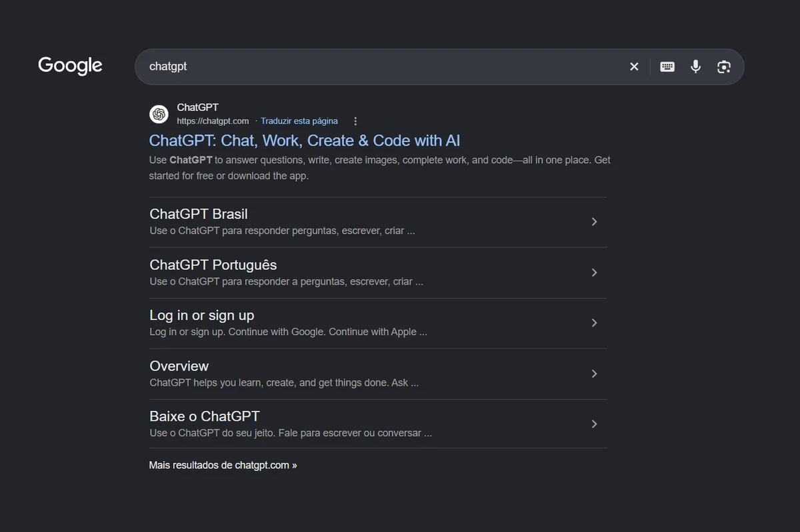
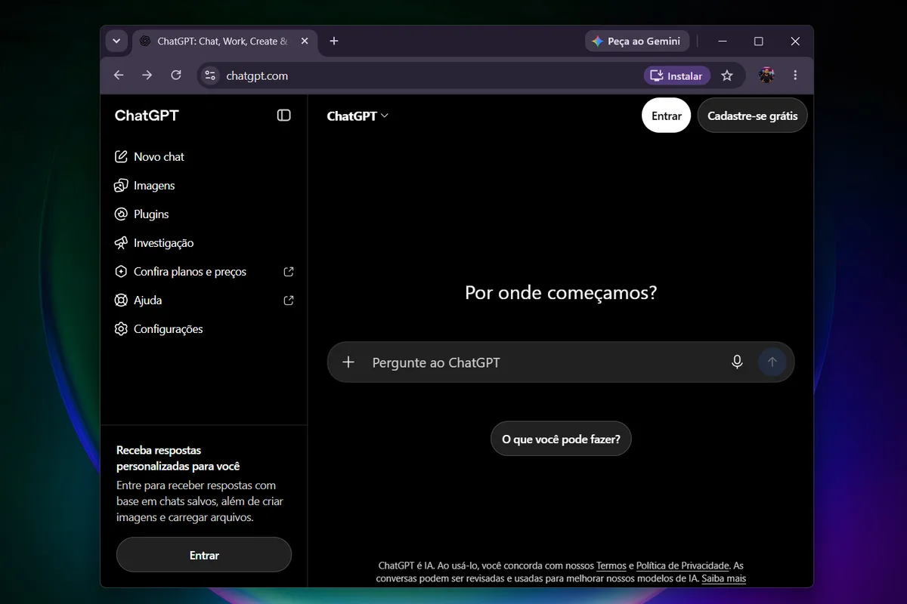

O **ChatGPT login** é feito no endereço [chatgpt.com](https://chatgpt.com), com e-mail e senha ou com uma conta Google, Microsoft ou Apple. A conta é gratuita, e o mesmo acesso vale no navegador do PC e no aplicativo do celular.

Quando o login falha, quase sempre a causa é simples: método de acesso diferente do usado no cadastro, cache do navegador ou código de verificação que não chegou. Abaixo estão o passo a passo e as correções, uma a uma.

## Como encontrar o site oficial do ChatGPT

O caminho mais seguro é pesquisar por “chatgpt” no Google. O primeiro resultado é o site oficial, com o endereço **https://chatgpt.com** logo acima do título. Abaixo dele, o Google mostra atalhos para as páginas internas, como a versão em português (“ChatGPT Brasil” e “ChatGPT Português”), o “Log in or sign up”, que leva direto à tela de entrada, e o “Baixe o ChatGPT”, com os aplicativos.

_No Google, o resultado oficial vem primeiro e mostra o endereço chatgpt.com. Confira sempre esse domínio antes de clicar._

## Como fazer login no ChatGPT pelo computador

O processo leva menos de um minuto:

1.  Abra o navegador e acesse [chatgpt.com](https://chatgpt.com).
2.  Clique em **Entrar**, no canto superior direito. Ao lado dele fica o botão **Cadastre-se grátis**, para quem ainda não tem conta.
3.  Digite o e-mail da conta ou escolha **Continuar com Google**, **Microsoft** ou **Apple**.
4.  Informe a senha ou o código de verificação enviado por e-mail, se a plataforma pedir.

Na tela inicial, sem estar logado, o ChatGPT já mostra o campo “Pergunte ao ChatGPT”. Mesmo assim, vale entrar: o aviso na barra lateral explica que o login serve para receber respostas com base em chats salvos, além de criar imagens e carregar arquivos. O botão **Entrar** aparece duas vezes, no topo e na lateral, e os dois levam ao mesmo lugar.

_Página inicial sem login: os botões “Entrar” e “Cadastre-se grátis” ficam no canto superior direito._

Depois do login, o chat abre e o histórico das conversas aparece na barra lateral. Quem usa o mesmo computador com outras pessoas deve sair da conta ao terminar.

### Como a tela fica depois de entrar

Com o login feito, o nome da conta aparece no canto inferior esquerdo, junto ao plano em uso. Na conta gratuita, o rótulo mostra **Free**, ao lado do botão **Fazer upgrade**, que leva aos planos pagos. No topo, o botão **Ver planos** repete esse atalho.

A barra lateral ganha os recursos que ficavam bloqueados: **Novo chat**, **Imagens**, **Biblioteca**, **Agendados**, **Plugins**, **Projetos**, **Codex** e **Mais**. Acima do campo de mensagem, as abas **Chat** e **Work** alternam entre conversa comum e trabalho mais longo. O campo tem ainda o botão **Pensar** e o microfone para falar em vez de digitar.

_Conta logada no plano gratuito: o rótulo “Free” e o botão “Fazer upgrade” ficam no canto inferior esquerdo._

Os nomes e a posição dos menus mudam com as atualizações da OpenAI. Se algo estiver em outro lugar, procure pelo nome do recurso.

## Como entrar pelo celular

No Android e no iPhone, o caminho é o mesmo. Baixe o aplicativo oficial do ChatGPT na loja do seu aparelho, abra e toque em **Entrar**. Use o mesmo método do cadastro para ver as conversas já feitas no computador.

Vale conferir se o app é o da OpenAI, o desenvolvedor que aparece na página da loja, porque aplicativos de terceiros podem usar o nome do ChatGPT.

## Como criar uma conta no ChatGPT

Quem ainda não tem conta segue quase o mesmo caminho: em [chatgpt.com](https://chatgpt.com), clique em **Cadastrar-se**, informe um e-mail ou use uma conta Google, Microsoft ou Apple e confirme os dados.

Uma regra importante: segundo a OpenAI, é preciso ter no mínimo 13 anos, ou a idade mínima do país. Menores de 18 anos precisam da permissão de um responsável.

## ChatGPT login não funciona: o que fazer

Antes de mexer em qualquer configuração, confira o [status oficial dos serviços da OpenAI](https://status.openai.com). Se houver instabilidade, só resta esperar. Sem problema no serviço, teste estas correções, nesta ordem:

-   **Use o mesmo método do cadastro.** Se a conta foi criada com “Continuar com Google”, “Microsoft” ou “Apple”, o login com e-mail e senha comum não funciona, e vice-versa.
-   **Abra uma janela anônima.** Extensões e dados antigos do navegador podem travar o botão de entrada. Se funcionar ali, o problema está na extensão ou no cache.
-   **Limpe o cache e os cookies.** Depois, feche o navegador e tente de novo. Se o navegador em si estiver lento, veja o comparativo do [melhor navegador para PC em 2026](/melhor-navegador-para-pc/).
-   **Desative bloqueadores de anúncios e VPN por alguns minutos.** Eles podem impedir a etapa de verificação.
-   **Procure o código nos e-mails.** Olhe a caixa de spam e libere o remetente noreply@openai.com. Se o código não chega, troque de rede ou de navegador.
-   **Teste outro dispositivo.** Se funcionar no celular e não no PC, o problema está no navegador ou no computador.

Se a conta tiver sido suspensa ou desativada, o acesso fica bloqueado. Nesse caso, a OpenAI costuma explicar o motivo por e-mail, e o caminho é falar com o suporte pela [Central de Ajuda da OpenAI](https://help.openai.com/en/articles/7426629-why-cant-i-log-in-to-chatgpt).

## Dicas de segurança para o login

- **Digite o endereço direto.** Prefira entrar por [chatgpt.com](https://chatgpt.com) em vez de clicar em anúncios ou links recebidos por mensagem, que podem levar a páginas falsas.
- **Use uma senha exclusiva** e, se possível, ative a verificação em duas etapas nas configurações da conta.
- **Não compartilhe códigos de verificação** com ninguém, nem com quem diga ser do suporte.

## O que fazer depois de entrar

Com a conta ativa, veja [o que muda entre o ChatGPT grátis e os planos pagos](/chatgpt-gratis-ou-pago/) antes de assinar qualquer coisa. O próximo passo é aprender a pedir melhor. Se você ainda não sabe [o que significa GPT](/o-que-significa-gpt/), vale entender a tecnologia por trás do chat. Para praticar, teste os [46 comandos do ChatGPT para criar imagens](/46-comandos-do-chatgpt/) ou veja como gerar vídeo direto na conversa com o [plugin Higgsfield](/plugin-higgsfield-chatgpt/).

## Perguntas frequentes

### O ChatGPT login é gratuito?

_Sim, criar a conta e entrar não custa nada. A conta gratuita tem limites de uso, e existem planos pagos com mais recursos._

### Qual é o site oficial do ChatGPT?

_O endereço é chatgpt.com. Desconfie de páginas parecidas que peçam pagamento ou dados fora do login padrão._

### Posso entrar com a conta do Google?

_Sim. A tela de entrada oferece “Continuar com Google”, além de Microsoft e Apple. Só é preciso usar sempre o mesmo método que foi escolhido no cadastro._

### Por que o ChatGPT não envia o código de verificação?

_As causas mais comuns são o código na caixa de spam, bloqueio do remetente pelo provedor de e-mail e uso de VPN ou bloqueador de anúncios. Libere noreply@openai.com e tente de novo._

### Menor de idade pode ter conta no ChatGPT?

_Segundo a OpenAI, é preciso ter no mínimo 13 anos. Quem tem menos de 18 anos precisa da permissão de um responsável._
