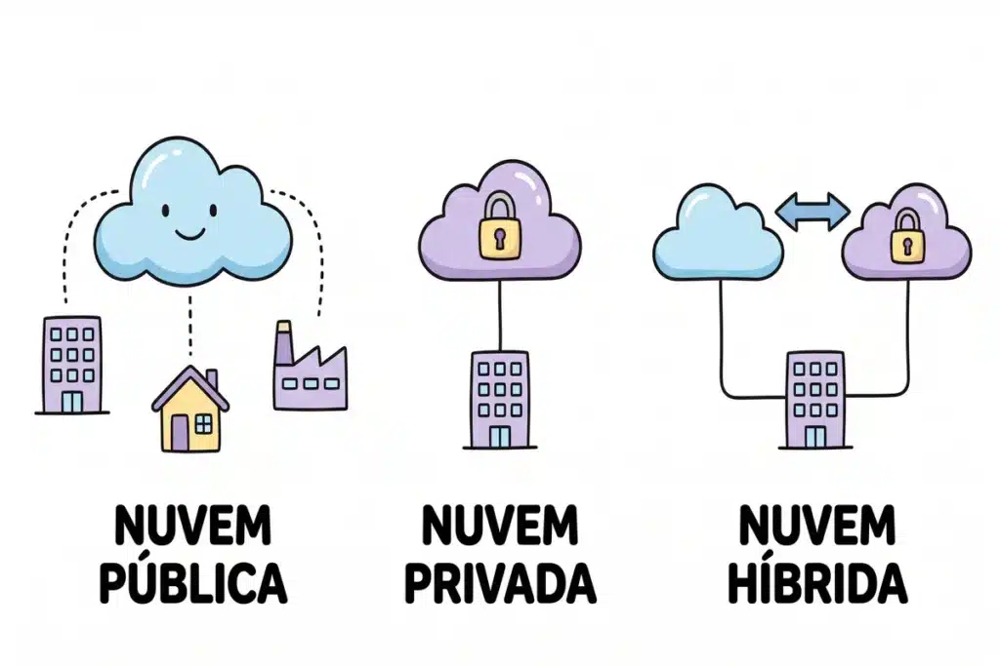

## Introdução

Guardar arquivos apenas no disco rígido local é cada vez mais raro nas empresas modernas, e essa mudança tem um nome técnico que aparece com frequência crescente nas provas de Informática: cloud storage. Antes de tudo, vale entender o que essa tecnologia representa: em vez de depender de um disco físico, você transfere seus dados para servidores remotos conectados à internet, e um provedor especializado assume toda a estrutura por trás disso.

Esse tema mistura conceitos de Sistemas de Informação e de Segurança da Informação, o que torna a banca examinadora bastante atenta aos detalhes. Por isso, ela espera que você reconheça os tipos de nuvem, identifique quem responde por cada camada de segurança e não confunda cloud storage com uma rotina de backup.

Nesta aula, você vai entender o conceito central de cloud storage, diferenciar as formas de implantação segundo o NIST e resolver questões no estilo das principais bancas.

## O que é cloud storage (armazenamento de dados na nuvem)?

Cloud storage é o modelo em que você salva arquivos em sistemas lógicos virtuais, mantidos por um provedor de tecnologia externo. Você faz o upload dos dados pela internet, e a empresa provedora hospeda essa informação em data centers próprios, muitas vezes espalhados por diferentes regiões geográficas.

Em outras palavras, o provedor assume a manutenção dos equipamentos físicos. Enquanto isso, você aluga apenas o espaço e consome o recurso sob demanda, sem precisar comprar ou manter servidor algum.

Justamente por isso, o cloud storage oferece grande flexibilidade: você aumenta ou diminui rapidamente o espaço contratado, conforme a necessidade do momento. Aliás, as bancas costumam tratar esse comportamento técnico como escalabilidade ou elasticidade, então guarde bem os dois termos, porque eles aparecem como sinônimos nas alternativas.

## Formas de implantação: os tipos de nuvem segundo o NIST

Em seguida, você precisa conhecer as formas de implantação que o NIST (National Institute of Standards and Technology) descreve na sua arquitetura de referência para computação em nuvem. Com essa base teórica, fica muito mais fácil acertar as questões conceituais, já que a maioria delas cobra justamente a definição de cada modelo.

### Nuvem pública

Na nuvem pública, o provedor abre a infraestrutura ao público em geral ou a um grande grupo de organizações. Dessa maneira, empresas externas vendem os serviços de armazenamento em regime compartilhado. Como resultado, esse modelo reduz fortemente os custos de manutenção para quem contrata.

### Nuvem privada

Por outro lado, a nuvem privada opera exclusivamente para uma única organização. Assim, a própria empresa ou uma equipe terceirizada gerencia toda a estrutura. Além disso, esse modelo garante maior controle sobre a segurança física dos servidores, já que nenhuma outra organização compartilha aquele ambiente.

### Nuvem híbrida

Logo depois, aparece a nuvem híbrida, que combina duas ou mais infraestruturas distintas. Nesse cenário, as redes pública e privada permanecem como entidades únicas. Contudo, uma tecnologia específica conecta as duas e permite a portabilidade de dados e aplicativos entre elas.

### Nuvem comunitária

Por fim, várias organizações com interesses em comum compartilham a nuvem comunitária. Essas empresas dividem requisitos de segurança ou políticas de conformidade semelhantes. Portanto, assim como na versão privada, os próprios membros da comunidade administram o ambiente.

## Vantagens do cloud storage que mais caem em prova

De fato, o cloud storage entrega vantagens operacionais que aparecem com frequência nas provas. Confira os pontos que a banca mais cobra:

-   **Acesso remoto**: você acessa os arquivos de qualquer lugar, desde que tenha conexão com a internet e credenciais válidas.
-   **Colaboração**: vários usuários abrem e editam o mesmo arquivo ao mesmo tempo, sem precisar trocar versões por e-mail.
-   **Mobilidade**: a tecnologia atende desktops, notebooks, tablets e smartphones com a mesma eficiência.
-   **Redução de custos**: o modelo elimina a necessidade de comprar e manter servidores físicos locais, que costumam ser caros e complexos de operar.

## Riscos e cuidados de segurança no cloud storage

No entanto, transferir dados para servidores de terceiros também cria desafios sérios de segurança da informação. Por essa razão, as bancas testam bastante o limite da proteção que a nuvem realmente oferece.

Antes de mais nada, memorize este ponto: o cloud storage não elimina a necessidade de autenticação e controle de acesso. O provedor cuida da segurança física dos equipamentos, mas você continua responsável por criar senhas fortes e gerenciar as permissões da sua conta.

Além do mais, o vazamento de credenciais expõe informações sigilosas a invasores em qualquer lugar do mundo. Sendo assim, o administrador precisa aplicar práticas rigorosas, como autenticação multifator (MFA) e criptografia, para proteger o ambiente digital de ponta a ponta. Vale a pena revisar também os principais [malwares e ameaças à segurança da informação](/malwares-e-ameacas-seguranca-da-informacao/), já que muitos ataques exploram justamente falhas de credenciais mal protegidas. Da mesma forma, ferramentas como [antivírus, firewall e antispyware](/aplicativos-para-seguranca-antivirus-firewall-antispyware/) seguem indispensáveis mesmo quando os arquivos moram na nuvem.

## Cloud storage não é sinônimo de backup

Vale destacar a relação entre nuvem e rotinas de contingência, porque essa é uma das principais pegadinhas das provas. Muitas vezes, a banca afirma que a nuvem cria cópias automáticas indestrutíveis dos seus arquivos. Essa afirmação, porém, está errada.

Na prática, o cloud storage facilita as rotinas de [backup e segurança da informação](/backup-seguranca-da-informacao/), mas não substitui um backup planejado. Se você deletar um arquivo na pasta local por engano, o sistema de sincronização também apaga esse mesmo item no servidor remoto, já que ele apenas espelha as suas ações.

Portanto, para transformar a nuvem em uma ferramenta de contingência de verdade, o administrador precisa configurar políticas claras de retenção e versionamento, seguindo princípios como a [regra 3-2-1 de backup](/regra-3-2-1/). Assim, ele separa a pasta de trabalho diária do repositório final, que deve permanecer intocável.

Nesse ponto, vale revisar também os três tipos de backup que costumam aparecer nas provas ao lado do cloud storage: completo, incremental e diferencial.

💾

Backup e armazenamento em nuvem

📦 Tipos de backup

 
| Tipo | O que copia |
| --- | --- |
| 📄 Completo | Todos os arquivos, sempre, independentemente de terem sido alterados ou não. |
| ➕ Incremental | Somente o que mudou desde o último backup, seja ele completo ou incremental. |
| 🔄 Diferencial | Tudo o que mudou desde o último backup completo. |

**Exemplo prático:** no domingo, você faz um backup completo (copia tudo). Na segunda, um incremental (só o que mudou desde domingo). Na terça, outro incremental (só o que mudou desde segunda). Se precisar restaurar na quarta, você vai precisar do completo e dos dois incrementais, nessa ordem.

<strong class="cai-prova">💡 Cai na prova:</strong> o backup incremental é mais rápido de fazer, mas mais lento para restaurar, porque exige todos os incrementos em ordem. Já o backup diferencial ocupa mais espaço em disco, mas restaura mais rápido, pois basta o completo somado ao último diferencial.

Não confunda os dois conceitos na hora da prova: se a banca afirmar que o backup incremental restaura os dados mais rápido que o diferencial, desconfie, porque geralmente ocorre o oposto.

## Perguntas frequentes sobre cloud storage

❓ Perguntas frequentes sobre cloud storage

Cloud storage e backup na nuvem são a mesma coisa? +

Não. O cloud storage é o serviço de armazenamento em si, enquanto o backup é uma rotina planejada de proteção contra perda de dados. Se você apagar um arquivo na pasta sincronizada, o cloud storage replica essa exclusão no servidor remoto. Só uma política de retenção e versionamento, como a regra 3-2-1, garante uma cópia de segurança de verdade.

Quais são os quatro tipos de nuvem segundo o NIST? +

O NIST descreve quatro formas de implantação: nuvem pública (infraestrutura aberta ao público em geral), nuvem privada (uso exclusivo de uma organização), nuvem híbrida (combinação de duas ou mais infraestruturas conectadas) e nuvem comunitária (compartilhada por organizações com interesses ou requisitos de conformidade em comum).

Quem é responsável pela segurança dos dados armazenados na nuvem? +

A responsabilidade é compartilhada. O provedor cuida da segurança física dos data centers e da infraestrutura, mas o usuário continua responsável por senhas fortes, autenticação multifator e pelo gerenciamento correto das permissões de acesso à sua conta.

## Conclusão

Dominar o cloud storage exige atenção aos detalhes que separam um conceito do outro. Afinal, você precisa reconhecer os tipos de nuvem, distinguir as responsabilidades de segurança e entender por que a elasticidade é a característica que mais aparece em prova.

Revise os conceitos do NIST com frequência e desconfie de qualquer alternativa que trate a nuvem como solução mágica e infalível contra perda de dados. Assim, você treina a interpretação e evita cair nas pegadinhas mais comuns das bancas.

Agora que você já domina os conceitos de cloud storage, backup e segurança da informação, coloque o conhecimento à prova: resolva as dez questões comentadas logo abaixo e, na sequência, avance para o [simulado de Segurança da Informação](/simulado-seguranca-da-informacao/) com questões no estilo das principais bancas.

## Fontes e Referências

-   NIST Cloud Computing Reference Architecture (SP 500-292), do National Institute of Standards and Technology: [nist.gov/publications/nist-cloud-computing-reference-architecture](https://www.nist.gov/publications/nist-cloud-computing-reference-architecture)
-   Google Cloud. What is Cloud Storage & How Does It Work?: [cloud.google.com/learn/what-is-cloud-storage](https://cloud.google.com/learn/what-is-cloud-storage)

-   
    
    [Cebraspe: como funciona a banca e o que ela cobra em Informática](/cebraspe-como-funciona-a-banca-e-o-que-ela-cobra-em-informatica/)
-   
    
    [Como Estudar para Concurso Faltando Menos de 15 Dias para a Prova](/como-estudar-para-concurso/)
-   
    
    [Informática para concursos: 5 confusões clássicas e como a banca as cobra](/informatica-para-concursos-5-duvidas-prova/)
-   
    
    [10 dicas para gabaritar a prova de Informática da Cebraspe PM MA 2026](/informatica-cebraspe-pm-ma-2026/)
-   
    
    [Windows 10: Guia Completo para Concursos Públicos](/windows-10-para-concursos/)
