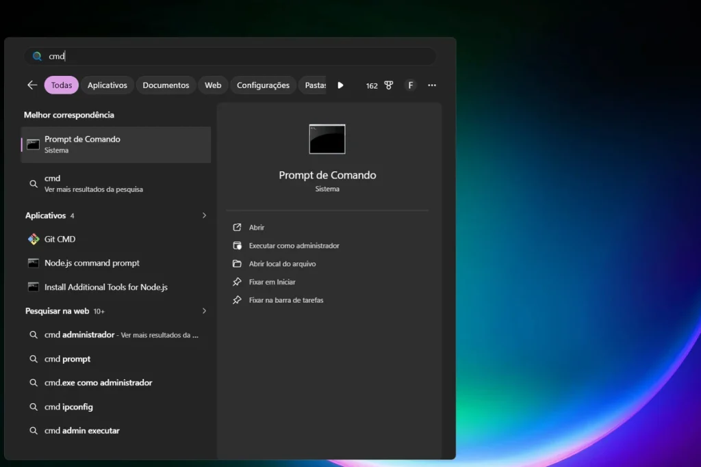
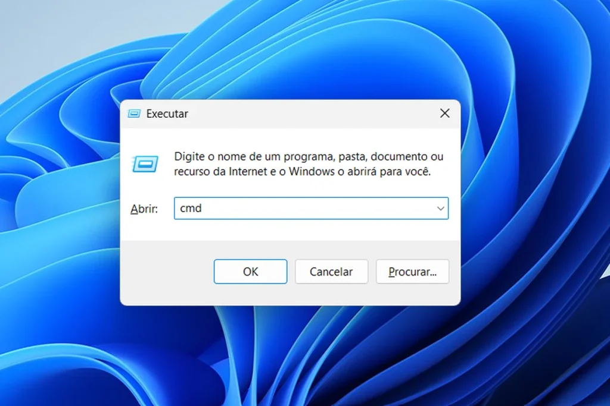
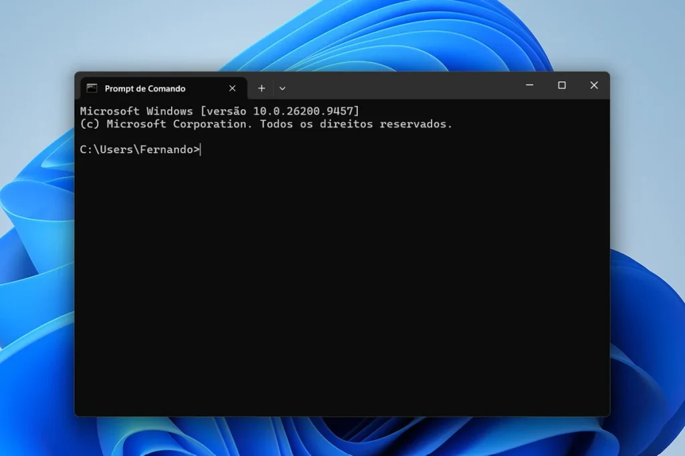

O **cmd** (Prompt de Comando) do Windows verifica o disco, varre vírus e agenda tarefas com poucas linhas de texto, sem instalar nada. Bastam 20 comandos nativos para cobrir a manutenção básica do PC.

A interface é antiga, mas o cmd segue no Windows 10 e 11 porque é rápido e funciona até quando o sistema dá problema. Todos os comandos abaixo já vêm instalados de fábrica.

## Como abrir o cmd pelo menu Iniciar ou pelo Executar

Existem dois caminhos rápidos até o cmd, e os dois levam à mesma janela.

**Pelo menu Iniciar:**

1.  Aperte a tecla Windows e digite cmd
2.  Clique com o botão direito em Prompt de Comando, no resultado da busca
3.  Escolha Executar como administrador



**Pelo atalho Windows + R:**

1.  Aperte Windows + R para abrir a caixa Executar
2.  Digite cmd
3.  Pressione Enter para abrir normal, ou Ctrl + Shift + Enter para já abrir como administrador



Os dois métodos abrem a mesma janela preta de texto, pronta para receber os comandos.



Sem permissão elevada, comandos como chkdsk, sfc e schtasks retornam “acesso negado”. Por isso, o passo 3 do menu Iniciar (ou o atalho Ctrl + Shift + Enter no Executar) não pode ser pulado.

A tabela resume as quatro áreas cobertas por este guia.

| 🖥️ Área | ⌨️ Comando principal | ✅ Para que serve |
| --- | --- | --- |
| 🌐 Configuração e rede | systeminfo, ipconfig | Ver dados do sistema e diagnosticar a rede |
| 💾 Disco | chkdsk, sfc, DISM | Checar e reparar erros no sistema de arquivos |
| 🛡️ Vírus | MpCmdRun, netstat | Rodar o Defender e investigar conexões suspeitas |
| ⏰ Tarefas agendadas | schtasks | Rodar um script em horário e frequência fixos |

As quatro áreas cobertas por este guia. Veja a lista completa com os 20 comandos logo abaixo.

## Configuração e rede: diagnóstico em segundos

Primeiramente, os comandos de consulta, que não alteram nada no sistema:

-   **systeminfo**: mostra versão do Windows, data de instalação, memória e atualizações aplicadas
-   **tasklist**: lista os processos ativos com o número de identificação (PID) de cada um
-   **taskkill /f /im notepad.exe**: encerra à força um programa travado, como o [Canaltech explica com o exemplo da calculadora](https://canaltech.com.br/windows/Conheca-alguns-comandos-do-Prompt-do-Windows-que-lhe-ajudarao-muito/)
-   **shutdown /r /t 300**: reinicia o computador em cinco minutos
-   **ipconfig /all**: exibe IP, gateway e DNS de cada adaptador
-   **ipconfig /flushdns**: limpa o cache de DNS quando um site não abre

## Como checar o disco pelo cmd

O **chkdsk C: /f** verifica o sistema de arquivos e corrige erros lógicos. Sem parâmetros, o comando apenas informa o estado do volume, conforme a [documentação da Microsoft sobre o chkdsk](https://learn.microsoft.com/en-us/windows-server/administration/windows-commands/chkdsk). No disco do sistema, o Windows pede para agendar a verificação na próxima reinicialização.

Na sequência, entram os reparos do próprio Windows:

-   **sfc /scannow**: varre os arquivos do sistema e repara os corrompidos
-   **DISM /Online /Cleanup-Image /RestoreHealth**: repara a imagem que o sfc usa como referência; rode quando o sfc não resolver
-   **fsutil volume diskfree C:**: mostra espaço livre e total do volume
-   **defrag C: /O**: otimiza conforme o tipo de unidade, desfragmentando HD e executando TRIM em SSD
-   **robocopy C:\\Origem D:\\Backup /E**: copia pastas com subpastas e serve de base para backups

## Como verificar vírus pelo cmd

O Microsoft Defender tem uma ferramenta de linha de comando, o MpCmdRun. Primeiro, atualize as definições:

`"%ProgramFiles%\Windows Defender\MpCmdRun.exe" -SignatureUpdate`

Depois, troque `-SignatureUpdate` por `-Scan -ScanType 1` para uma varredura rápida. O valor 2 executa a varredura completa, mais demorada.

Outros dois comandos ajudam na investigação. O **netstat -ano** lista as conexões ativas com o PID de cada processo, e cruzar o número com o tasklist revela programas desconhecidos ligados à internet. Já o **attrib -h -s -r /s /d E:\*.**\* desoculta arquivos escondidos em um pendrive, situação comum quando um vírus transforma pastas em atalhos.

Os comandos apoiam, mas não substituem, um antivírus completo.

## Como criar uma tarefa agendada com script no cmd

Salve no Bloco de Notas um arquivo chamado backup.bat, dentro de C:\\scripts, com três linhas:

```
@echo off
robocopy C:\Documentos D:\Backup /E /R:1 /W:1
echo Backup concluido em %date% %time% >> D:\Backup\log.txt
```

Em seguida, registre a tarefa com o **schtasks**:

`schtasks /create /tn "Backup" /tr "C:\scripts\backup.bat" /sc daily /st 22:00`

O parâmetro /tn dá o nome da tarefa, /tr aponta o script e /sc define a frequência. Para testar, rode `schtasks /run /tn "Backup"`. Para conferir, use /query; para apagar, /delete. A [referência do schtasks](https://learn.microsoft.com/en-us/windows-server/administration/windows-commands/schtasks) traz todas as opções.

## Lista completa dos 20 comandos para copiar

Cole no cmd aberto como administrador e troque letras de unidade, pastas e nomes pelos do seu computador.

| 🏷️ Categoria | ⌨️ Comando | 📝 Descrição | 📋 Copiar |
| --- | --- | --- | --- |
| 🌐 Rede | systeminfo | Mostra versão do Windows, memória e atualizações | 📋 Copiar |
| 🌐 Rede | tasklist | Lista os processos ativos com o PID de cada um | 📋 Copiar |
| 🌐 Rede | taskkill /f /im nomedoprograma.exe | Encerra à força um programa travado | 📋 Copiar |
| 🌐 Rede | shutdown /r /t 300 | Reinicia o computador em cinco minutos | 📋 Copiar |
| 🌐 Rede | ipconfig /all | Exibe IP, gateway e DNS de cada adaptador | 📋 Copiar |
| 🌐 Rede | ipconfig /flushdns | Limpa o cache de DNS | 📋 Copiar |
| 💾 Disco | chkdsk C: /f | Verifica e corrige erros no sistema de arquivos | 📋 Copiar |
| 💾 Disco | sfc /scannow | Repara arquivos corrompidos do sistema | 📋 Copiar |
| 💾 Disco | DISM /Online /Cleanup-Image /RestoreHealth | Repara a imagem do Windows usada pelo sfc | 📋 Copiar |
| 💾 Disco | fsutil volume diskfree C: | Mostra espaço livre e total do volume | 📋 Copiar |
| 💾 Disco | defrag C: /O | Otimiza o disco conforme o tipo de unidade | 📋 Copiar |
| 💾 Disco | robocopy C:\\Origem D:\\Backup /E | Copia pastas com subpastas para backup | 📋 Copiar |
| 🛡️ Vírus | MpCmdRun.exe -SignatureUpdate | Atualiza as definições de vírus do Defender | 📋 Copiar |
| 🛡️ Vírus | MpCmdRun.exe -Scan -ScanType 1 | Roda uma varredura rápida de vírus | 📋 Copiar |
| 🛡️ Vírus | netstat -ano | Lista conexões ativas com o PID de cada processo | 📋 Copiar |
| 🛡️ Vírus | attrib -h -s -r /s /d E:\\\*.\* | Desoculta arquivos escondidos em um pendrive | 📋 Copiar |
| ⏰ Tarefa | schtasks /create /tn “Backup” /tr “C:\\scripts\\backup.bat” /sc daily /st 22:00 | Cria uma tarefa agendada diária | 📋 Copiar |
| ⏰ Tarefa | schtasks /run /tn “Backup” | Executa a tarefa agendada na hora | 📋 Copiar |
| ⏰ Tarefa | schtasks /query /tn “Backup” | Mostra os detalhes da tarefa agendada | 📋 Copiar |
| ⏰ Tarefa | schtasks /delete /tn “Backup” | Remove a tarefa agendada | 📋 Copiar |

Clique em “Copiar” para colar o comando direto no cmd aberto como administrador. Troque letras de unidade, pastas e nomes pelos do seu computador.

## Conclusão

O cmd resolve em segundos o que exige vários cliques no Windows. Comece por sfc /scannow e chkdsk, os dois comandos que mais atacam lentidão e travamentos, e evolua para o schtasks quando quiser automatizar backups.

Quem dominar o cmd fica pronto para o PowerShell, o próximo passo natural em automação mais avançada. Para uma limpeza sem linha de comando, veja como [limpar os arquivos temporários do Windows](/limpar-arquivos-temporarios-windows/), e para escolher o programa que mais roda no seu PC, compare o [melhor navegador para PC em 2026](/melhor-navegador-para-pc/).

## Perguntas frequentes

### Como abrir o cmd no Windows 11?

_Pelo menu Iniciar, digite cmd, clique com o botão direito em Prompt de Comando e escolha Executar como administrador. Pelo atalho Windows + R, digite cmd e use Ctrl + Shift + Enter para já abrir com permissão elevada._

### O chkdsk apaga arquivos?

_Em geral não. O chkdsk corrige erros na estrutura do sistema de arquivos, mas pode descartar fragmentos corrompidos que não consegue recuperar. Por isso, faça backup antes de rodar o /f em um disco que já dá sinais de falha._

### O cmd substitui o antivírus?

_Não. O MpCmdRun apenas controla o Microsoft Defender pela linha de comando, e o netstat e o attrib ajudam na investigação. A proteção em tempo real continua vindo do antivírus instalado, que precisa ficar ativo e atualizado._
