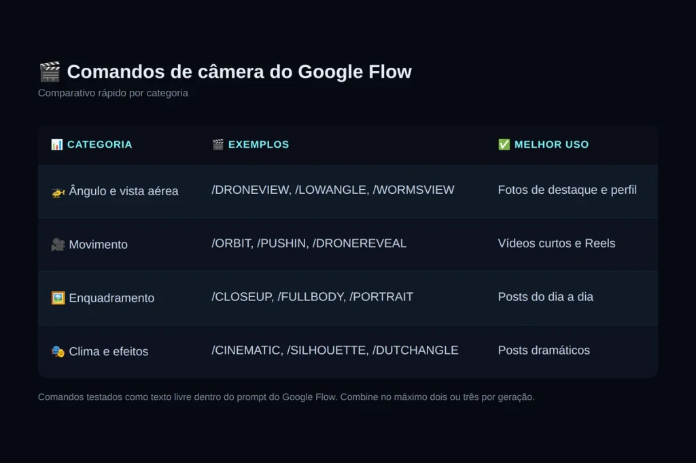

Os **comandos de câmera do Google Flow** são etiquetas curtas que dizem à IA como enquadrar a cena, do drone lá de cima ao close no rosto. O resultado muda na hora: sai a selfie genérica, entra a foto com cara de produção.

Quem digita só “faça uma foto legal minha” recebe um resultado aleatório. Quem usa um comando de ângulo ou de movimento controla o enquadramento antes mesmo de gerar a imagem, e a diferença aparece já na primeira comparação.

Este guia reúne os 40 comandos por categoria, com uma tabela para consulta rápida e exemplos prontos para copiar.

## O que são os comandos de câmera no Google Flow

Um comando de câmera funciona como uma lista de planos de diretor, só que em texto. Em vez de descrever a cena de forma vaga, o usuário informa ângulo, distância e movimento no próprio prompt.

É a diferença entre pedir “tira uma foto bonita” e pedir “fotografa de baixo para cima, em close, com fundo desfocado”. A primeira instrução gera algo aleatório. A segunda entrega um resultado definido.

Vale um alerta: as etiquetas listadas aqui não constam como recurso oficial na [documentação do Google Flow](https://labs.google/flow/about). Elas se popularizaram em publicações nas redes sociais, e o modelo as interpreta como parte comum do prompt. Por isso, o resultado pode variar entre uma geração e outra.

## Ângulo e vista aérea: para fotos de destaque

Este grupo define a altura da câmera em relação à pessoa. Funciona bem em fotos de perfil e capas, mas pode soar exagerado em um post do dia a dia.

-   ✅ **/DRONEVIEW**: vista aérea alta
-   ✅ **/LOWANGLE**: câmera de baixo para cima, transmite poder
-   ✅ **/WORMSVIEW**: ângulo extremamente baixo e dramático
-   **/TOPDOWN**, **/BIRDSEYE**, **/OVERHEAD**, **/EXTREMETOPDOWN**: variações de vista direto de cima
-   **/DRONE3Q**, **/HIGHANGLE**, **/GROUNDLEVEL**, **/LOWUP**: ângulos diagonais e rasteiros

## Movimento de câmera: para vídeos curtos

Estes comandos simulam deslocamento no espaço. O Google Flow traduz isso em desfoque de movimento e mudança de profundidade, e rendem mais em vídeo do que em imagem estática. ⏱️

-   ✅ **/PUSHIN**: câmera se aproxima da pessoa
-   ✅ **/ORBIT**: câmera circula o sujeito
-   ✅ **/DRONEREVEAL**: recua e revela o cenário todo
-   **/TRACKING**, **/ORBITCLOSE**, **/PULLOUT**, **/CRANEUP**, **/MOTIONBLUR**, **/AERIALTRACK**: variações de aproximação e perseguição

## Enquadramento e clima: para composição intencional

Aqui o foco é distância e atmosfera, não altura. São os comandos que separam um registro qualquer de uma imagem pensada.

-   **Enquadramento**: /CLOSEUP, /MEDIUMSHOT, /FULLBODY, /PORTRAIT, /WIDEANGLE, /LONGSHOT, /PROFILE, /CLOSEPROFILE, /OVERSHOULDER, /POV, /BEHIND, /EYELEVEL
-   **Clima**: /CINEMATIC, /DUTCHANGLE, /DUTCHTILT, /SILHOUETTE, /REFLECTION, /FRAMED, /THROUGHOBJECT, /THROUGHNET

## Como aplicar nas suas próprias fotos

Envie uma foto nítida e bem iluminada. Depois, escreva o prompt descrevendo o cenário e inclua a etiqueta no fim.

Exemplo: _“Uma pessoa em pé numa cozinha moderna, /LOWANGLE, luz natural, roupa casual.”_

Dá para combinar dois comandos, como /PORTRAIT com /CINEMATIC, para um resultado estilo revista. Acima de três, o modelo tende a ignorar parte das instruções.

❌ Erros comuns: usar o comando sem descrever o cenário (gera uma pessoa “flutuando” no fundo), misturar ângulos opostos como /TOPDOWN e /EYELEVEL, ou partir de foto borrada.

## Lista completa: os 40 comandos para copiar

| 🏷️ Categoria | 🎬 Comando | 📝 Descrição | 📋 Copiar |
| --- | --- | --- | --- |
| 🚁 Ângulo | /DRONEVIEW | Vista aérea alta | 📋 Copiar |
| 🚁 Ângulo | /TOPDOWN | Câmera exatamente acima da pessoa | 📋 Copiar |
| 🚁 Ângulo | /BIRDSEYE | Perspectiva de olho de pássaro | 📋 Copiar |
| 🚁 Ângulo | /OVERHEAD | Câmera diretamente sobre a cabeça | 📋 Copiar |
| 🚁 Ângulo | /EXTREMETOPDOWN | Vista aérea muito alta, em linha reta para baixo | 📋 Copiar |
| 🚁 Ângulo | /DRONE3Q | Drone alto, em ângulo diagonal | 📋 Copiar |
| 🚁 Ângulo | /LOWANGLE | Câmera de baixo para cima, transmite poder | 📋 Copiar |
| 🚁 Ângulo | /HIGHANGLE | Câmera de cima para baixo | 📋 Copiar |
| 🚁 Ângulo | /GROUNDLEVEL | Câmera rente ao chão | 📋 Copiar |
| 🚁 Ângulo | /WORMSVIEW | Ângulo extremamente baixo, dramático | 📋 Copiar |
| 🚁 Ângulo | /LOWUP | Close em ângulo baixo, passa confiança | 📋 Copiar |
| 🎥 Movimento | /TRACKING | Câmera em movimento, estilo cinema | 📋 Copiar |
| 🎥 Movimento | /ORBIT | Câmera circula a pessoa | 📋 Copiar |
| 🎥 Movimento | /ORBITCLOSE | Órbita mais próxima ao redor da pessoa | 📋 Copiar |
| 🎥 Movimento | /PUSHIN | Câmera se aproxima da pessoa | 📋 Copiar |
| 🎥 Movimento | /PULLOUT | Câmera se afasta da pessoa | 📋 Copiar |
| 🎥 Movimento | /CRANEUP | Movimento de grua, de baixo para cima | 📋 Copiar |
| 🎥 Movimento | /DRONEREVEAL | Câmera recua e revela o cenário completo | 📋 Copiar |
| 🎥 Movimento | /MOTIONBLUR | Pessoa em movimento, com efeito de desfoque | 📋 Copiar |
| 🎥 Movimento | /AERIALTRACK | Drone acompanha a pessoa a partir do alto | 📋 Copiar |
| 🖼️ Enquadramento | /CLOSEUP | Close focado no rosto | 📋 Copiar |
| 🖼️ Enquadramento | /MEDIUMSHOT | Plano médio, da cintura para cima | 📋 Copiar |
| 🖼️ Enquadramento | /FULLBODY | Corpo inteiro visível na cena | 📋 Copiar |
| 🖼️ Enquadramento | /PORTRAIT | Enquadramento clássico de retrato | 📋 Copiar |
| 🖼️ Enquadramento | /WIDEANGLE | Plano aberto, com destaque para o ambiente | 📋 Copiar |
| 🖼️ Enquadramento | /LONGSHOT | Pessoa pequena, cenário grande | 📋 Copiar |
| 🖼️ Enquadramento | /PROFILE | Perfil lateral da pessoa | 📋 Copiar |
| 🖼️ Enquadramento | /CLOSEPROFILE | Perfil lateral em close | 📋 Copiar |
| 🖼️ Enquadramento | /OVERSHOULDER | Câmera por cima do ombro, olhando para a pessoa | 📋 Copiar |
| 🖼️ Enquadramento | /POV | Pessoa olha direto para a câmera | 📋 Copiar |
| 🖼️ Enquadramento | /BEHIND | Câmera posicionada atrás da pessoa | 📋 Copiar |
| 🖼️ Enquadramento | /EYELEVEL | Altura dos olhos, sem distorção | 📋 Copiar |
| 🎭 Clima | /CINEMATIC | Composição e profundidade de cinema | 📋 Copiar |
| 🎭 Clima | /DUTCHANGLE | Câmera inclinada, efeito dramático | 📋 Copiar |
| 🎭 Clima | /DUTCHTILT | Variação da inclinação, efeito semelhante | 📋 Copiar |
| 🎭 Clima | /SILHOUETTE | Silhueta contra a luz | 📋 Copiar |
| 🎭 Clima | /REFLECTION | Cena inclui um reflexo natural | 📋 Copiar |
| 🎭 Clima | /FRAMED | Pessoa emoldurada pelo ambiente ao redor | 📋 Copiar |
| 🎭 Clima | /THROUGHOBJECT | Cena vista através de um objeto em primeiro plano | 📋 Copiar |
| 🎭 Clima | /THROUGHNET | Cena vista através de rede, grade ou cerca | 📋 Copiar |

Clique em “Copiar” para colar o comando direto no prompt do Google Flow. Combine no máximo dois ou três por geração.

## Conclusão

Quarenta comandos parecem muita coisa, mas cinco ou seis já bastam para mudar o padrão do que sai do Google Flow. Comece por /LOWANGLE, /PORTRAIT e /CINEMATIC em uma única foto e compare com o resultado sem etiqueta nenhuma: a diferença fica óbvia no primeiro teste.

A tendência é que o Google amplie este tipo de controle por texto nas próximas atualizações do Flow, então vale salvar a lista e voltar a ela quando o modelo mudar. Antes de sair testando os 40 comandos, vale conferir quanto dá para gerar sem pagar nada: em [Google Flow grátis? Veja o que a IA de vídeo do Google oferece](/google-flow-gratis/) explicamos os limites do plano gratuito e quando compensa migrar para uma assinatura paga. Para o mesmo truque no ChatGPT, veja os [46 comandos do ChatGPT para criar imagens](/46-comandos-do-chatgpt/), e para gerar vídeo dentro do chat, o [plugin Higgsfield](/plugin-higgsfield-chatgpt/).

## Perguntas frequentes

### Preciso de plano pago para usar comandos de câmera no Google Flow?

_Não. Os comandos são apenas texto dentro do prompt, sem custo adicional. O número de gerações disponíveis por mês, porém, depende da sua assinatura da ferramenta._

### Posso usar mais de um comando no mesmo prompt?

_Sim. Combinar um comando de ângulo com um de clima costuma funcionar bem, como /PORTRAIT e /CINEMATIC. Usar três ou mais ao mesmo tempo tende a confundir o modelo._

### Os comandos funcionam em vídeo, além de foto?

_Sim, e rendem melhor ali. Comandos de movimento como /ORBIT, /PUSHIN e /DRONEREVEAL foram pensados para deslocamento no espaço, algo que uma imagem parada não mostra._

### Usar minha própria foto muda a qualidade do resultado?

_Não. O comando controla a câmera, não a pessoa. Uma foto nítida e bem iluminada funciona tão bem quanto qualquer outra, seja sua ou de outra pessoa._
