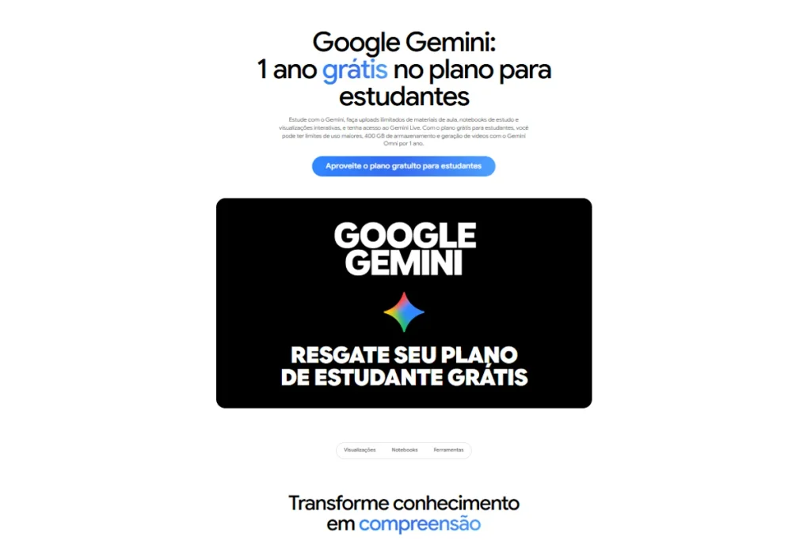

O Google oferece o **Google AI Plus para estudantes** universitários do Brasil sem custo por 12 meses. O plano inclui 400 GB de armazenamento e mais acesso ao Gemini para quem resgatar até 31 de dezembro de 2026.

Depois do ano gratuito, a assinatura passa a custar R$ 24,99 por mês, e o estudante pode cancelar quando quiser. As informações constam na página oficial do Gemini para estudantes.

## O que o Google AI Plus para estudantes inclui

Para começar, o plano zera a mensalidade por um ano e libera mais uso das ferramentas de IA do Google. Os principais benefícios são:

-   **Pesquisa e provas:** mais acesso ao Gemini e ao Gemini Notebook (caderno de estudos com IA) para analisar até 200 páginas de anotações de aula.
-   **Escrita e carreira:** mais acesso para criar rascunhos, organizar argumentos e refinar ideias.
-   **Imagens e vídeos:** mais acesso ao Gemini Omni Flash e ao Nano Banana (gerador de imagens do Google).
-   **Armazenamento:** 400 GB para Google Fotos, Drive e Gmail.

Além disso, a página oficial cita limites de uso maiores, uploads ilimitados de materiais de aula e acesso ao Gemini Live (modo de conversa por voz com a IA). O pacote também inclui 200 créditos do Google Flow, ferramenta de geração de vídeo. Quem quer testar sem pagar pode conferir como usar o [Google Flow grátis](https://techonplay.com.br/google-flow-gratis/).

## Quem pode resgatar e quais são as regras

Nem todo estudante se qualifica. A oferta exige:

-   ser estudante universitário com mais de 18 anos;
-   ser novo usuário ou ter o teste do AI Pro de 2025 já expirado;
-   resgatar até 31 de dezembro de 2026;
-   cadastrar uma forma de pagamento válida no momento da assinatura.

Vale destacar a verificação anual. O Google confere a condição de estudante todo ano, e quem não passar por essa etapa perde o acesso ao plano.

Como o cadastro pede forma de pagamento, a mensalidade de R$ 24,99 começa logo depois dos 12 meses. Por isso, o estudante deve marcar a data no calendário para cancelar a tempo, caso o plano deixe de fazer sentido. Os detalhes de cobrança e cancelamento ficam na [página de planos do Google One](https://one.google.com/about/plans?hl=pt-BR).

## Como resgatar o plano

O processo acontece direto no site do Google:

1.  Acesse a [página oficial do Gemini para estudantes](https://gemini.google/br/students/?hl=pt-BR).
2.  Clique em “Aproveite o plano gratuito para estudantes”.
3.  Siga as etapas de verificação e de assinatura.

## Google AI Pro também tem desconto

Quem precisa de mais recursos encontra o Google AI Pro com 75% de desconto por até quatro anos, conforme os termos da oferta. O plano custa R$ 23,99 por mês, em vez de R$ 96,99, e depois volta ao preço cheio.

Ele amplia o pacote com 5 TB de armazenamento, análise de até 1.500 páginas de anotações, Nano Banana Pro e acesso expandido a ferramentas de programação com IA, como Google Antigravity e Jules. O YouTube Premium Lite também vem incluído, sem custo adicional.

Na comparação de preços, o AI Pro com desconto (R$ 23,99) fica abaixo do AI Plus depois do ano grátis (R$ 24,99). A escolha depende do uso: o AI Plus zera o custo agora, enquanto o AI Pro cobra desde o início e entrega mais recursos.

## Comparativo dos planos

| 🏆 Plano | 💰 Preço | 💾 Armazenamento | 🚀 Limites de uso | 🎬 Imagens e vídeos | 🎯 Ideal para |
| --- | --- | --- | --- | --- | --- |
| Conta GoogleGemini sem assinatura  
Básico | R$ 0 | 15 GB | Limites padrão do Gemini | Geração de imagens e Flow com uso limitado | Uso ocasional e testes |
| Google AI PlusPlano do estudante  
Grátis por 12 meses | R$ 24,99 por mês. Estudante: R$ 0 por 12 meses | 400 GB | 2x maiores que o plano gratuito e até 200 páginas de anotações no Gemini Notebook | 200 créditos do Google Flow, geração de vídeos e mais acesso ao Nano Banana | Estudo diário, trabalhos e rascunhos |
| Google AI ProDesconto para estudantes  
Mais completo | R$ 96,99 por mês. Estudante: R$ 23,99 por até 4 anos | 5 TB | 4x maiores e até 1.500 páginas de anotações no Gemini Notebook | 1.000 créditos do Google Flow e Nano Banana Pro | Projetos grandes e programação com IA. Inclui YouTube Premium Lite |

Dados da página oficial do Gemini e da oferta para estudantes, conferidos em 20 de setembro de 2026. Preços e limites mudam com frequência, então confira no site do Google antes de assinar.

_Dados da página oficial do Gemini, conferidos em 20 de setembro de 2026. Preços e limites mudam com frequência, então confira no site do Google antes de assinar._

### Vale a pena resgatar o Google AI Plus para estudantes?

Em resumo, o Google AI Plus para estudantes reduz a zero o custo de uma assinatura de IA com armazenamento e ferramentas de estudo por 12 meses. Para quem já usa Gemini, Drive e Gmail no dia a dia, o benefício aparece rápido.

O resgate segue aberto até 31 de dezembro de 2026, e a verificação anual define quem mantém o acesso ao plano. Quem entrar no ecossistema de vídeo pode aprender os [comandos de câmera do Google Flow](https://techonplay.com.br/comandos-camera-google-flow/) para aproveitar os créditos.

## Perguntas frequentes

### Como resgatar o Google AI Plus para estudantes?

Acesse a página oficial do Gemini para estudantes e clique no botão de resgate. O Google pede a verificação da condição de universitário e uma forma de pagamento válida.

### O Gemini para estudantes é grátis mesmo?

Sim, por 12 meses. Depois, a mensalidade passa a ser R$ 24,99, e o estudante pode cancelar quando quiser.

### Até quando vale a oferta do Google AI Plus?

O resgate vale até 31 de dezembro de 2026. Novos usuários e quem teve o teste do AI Pro de 2025 expirado podem se qualificar.

### Qual a diferença entre Google AI Plus e AI Pro?

O AI Plus dá 400 GB e análise de até 200 páginas de anotações, sem custo por um ano. O AI Pro traz 5 TB, até 1.500 páginas, Nano Banana Pro e ferramentas de programação por R$ 23,99 mensais com desconto.

Antes que o prazo acabe, [resgate seu plano de estudante grátis na página oficial do Gemini](https://gemini.google/br/students/?hl=pt-BR) e comece a usar o Google AI Plus.

-   
    
    [Subway Surfers em alta: entenda o efeito de bbno$ e Buenos Aires](https://techonplay.com.br/subway-surfers-em-alta/)
-   
    
    [Google Flow grátis? Veja o que a IA de vídeo do Google oferece](https://techonplay.com.br/google-flow-gratis/)
-   
    
    [Plugin Higgsfield no ChatGPT: como gerar vídeos com códigos prontos](https://techonplay.com.br/plugin-higgsfield-chatgpt/)
-   
    
    [Navegadores alternativos em 2026: Brave, Opera, Vivaldi, Arc e mais](https://techonplay.com.br/navegadores-alternativos/)
-   
    
    [Melhor navegador para PC em 2026: Chrome, Edge ou Firefox? Compare](https://techonplay.com.br/melhor-navegador-para-pc/)
