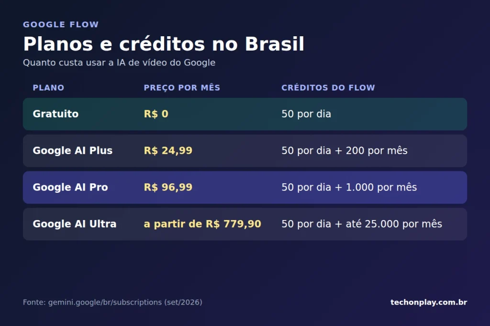

O **Google Flow**, estúdio de vídeo com inteligência artificial (IA) do Google, tem versão gratuita com 50 créditos por dia e usa o Veo 3.1, modelo que gera vídeo com áudio nativo. Os planos pagos começam em R$ 24,99 por mês no Brasil e ampliam créditos e recursos.

## O que é o Google Flow

O Google apresentou o Flow em maio de 2025, [no Google I/O](https://blog.google/innovation-and-ai/products/google-flow-veo-ai-filmmaking-tool/), como evolução do VideoFX, experimento do Google Labs. A ferramenta transforma textos e imagens em clipes, cenas e histórias completas.

Diferente de um gerador comum, o Flow funciona como espaço de trabalho. O usuário cria personagens, controla a câmera, estende cenas e organiza os arquivos em um só lugar.

Modelos do Google DeepMind sustentam a plataforma. Em fevereiro de 2026, segundo sites especializados, o Google também integrou o Whisk (moodboards) e o ImageFX (imagens) ao Flow.

## O ecossistema do Google Flow

O Flow reúne modelos, ferramentas de edição, música e apps em um só lugar. No Google I/O 2026, em maio, a empresa ampliou o pacote, segundo o 9to5Google.

### Modelos de IA

-   **Veo 3.1:** gera o vídeo com áudio nativo, ou seja, efeitos e diálogos criados junto com a imagem.
-   **Nano Banana Pro:** cria as imagens que servem de base para as cenas.
-   **Gemini Omni Flash:** mistura referências do mundo real com conteúdo gerado e permite ajustar o vídeo por conversa. Também mantém identidade e voz dos personagens entre as cenas.

### Ferramentas de criação e edição

-   **Ingredientes:** imagens de personagens, objetos e cenários que o usuário reutiliza nas cenas.
-   **Frames para vídeo:** o usuário define o primeiro e o último quadro, e o Flow preenche o trecho entre eles.
-   **Edição de cena:** o Flow insere objetos com sombra e iluminação naturais e remove elementos indesejados.
-   **Flow Agent:** age como parceiro criativo. Sugere diálogos, propõe versões de uma cena e faz edições em lote.
-   **Flow Tools:** presets que redimensionam vídeos e aplicam estilos e efeitos.

### Música e apps

O **Flow Music** cria trilhas e clipes musicais com controle de trechos da faixa, como traduzir ou mudar o estilo de uma parte. O editor de vídeo ganhou app dedicado, que estreia em beta no Android e chega depois ao iOS. O Flow Music faz o caminho inverso e começa pelo iOS.

### Integrações

O Veo 3.1 também funciona no app Gemini, na API do Gemini e no Vertex AI, plataforma de IA do Google Cloud para empresas. Já o Flow TV exibe uma vitrine de clipes feitos por outros criadores. Para empresas, o Flow virou serviço adicional do Google Workspace em 14 de janeiro de 2026, com controles de administrador.

## Quanto custa o Google Flow no Brasil

O Flow funciona por créditos, e cada geração de vídeo consome parte do saldo. Estes são os planos, de acordo com a [página oficial do Gemini no Brasil](https://gemini.google/br/subscriptions/) e com levantamentos de terceiros:

Um vídeo no modo Fast consome cerca de 20 créditos, e o modo Quality gasta cerca de 100, segundo o levantamento do CostGoat. Na prática, o plano gratuito rende aproximadamente dois vídeos rápidos por dia.

Os valores mudam com frequência. Confira sempre a página oficial antes de assinar.

## Como usar o Google Flow

O processo leva poucos minutos:

1.  Acesse o [Google Flow](https://flow.google.com/) com sua conta Google.
2.  Descreva a cena em texto ou envie imagens de referência, chamadas de “ingredientes”.
3.  Escolha o modo de geração: Fast para testar ideias, Quality para a versão final.
4.  Estenda a cena, ajuste a câmera e organize os clipes em uma história.

Cada geração rende clipes de cerca de 8 segundos. Por isso, o roteiro precisa se dividir em cenas curtas.

## Vale a pena usar o Google Flow?

Vale destacar três pontos fortes: o áudio nativo sincronizado, a consistência dos personagens entre cenas e a versão gratuita com Veo 3.1.

Por outro lado, o limite de créditos pesa para quem produz em volume. O plano gratuito serve para testar a ferramenta, mas criadores que publicam todo dia tendem a precisar do Pro ou do Ultra.

## O que esperar do Google Flow

O Google Flow deixou de ser apenas um gerador de vídeo e virou um estúdio criativo com agente, música e apps para celular. Com o Flow Agent e o Gemini Omni no centro da estratégia, a ferramenta deve ganhar mais automação nos próximos meses.

Enquanto isso, o plano gratuito funciona como porta de entrada. Aprenda os [comandos de câmera do Google Flow](/comandos-camera-google-flow/) para dirigir suas cenas. Quem é universitário ainda pode [resgatar o Google AI Plus grátis por um ano](/google-ai-plus-para-estudantes/), e quem prefere gerar vídeo dentro do chat pode ver o [plugin Higgsfield no ChatGPT](/plugin-higgsfield-chatgpt/).

## Perguntas frequentes

### O Google Flow é grátis?

_Sim, com limites. A versão gratuita oferece 50 créditos por dia e roda o Veo 3.1. Os planos pagos aumentam o saldo mensal e liberam mais recursos._

### Quanto custa o Google Flow no Brasil?

_O acesso vem dentro dos planos Google AI. O Plus custa R$ 24,99 por mês, o Pro custa R$ 96,99 e o Ultra parte de R$ 779,90._

### Qual modelo o Google Flow usa?

_O Flow usa o Veo 3.1 para vídeo com áudio nativo, o Nano Banana para imagens e o Gemini Omni Flash para edição por conversa._

### O Google Flow funciona no celular?

_Sim. O Google anunciou o editor de vídeo do Flow em app dedicado, com estreia em beta no Android e chegada posterior ao iOS. A versão web continua disponível._

### Quanto tempo dura um vídeo do Google Flow?

_Cada geração rende clipes de cerca de 8 segundos. Para vídeos maiores, o usuário estende a cena ou junta vários clipes._
