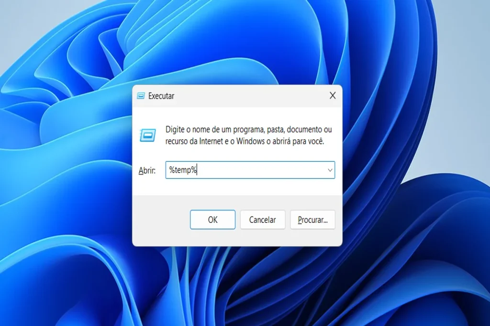
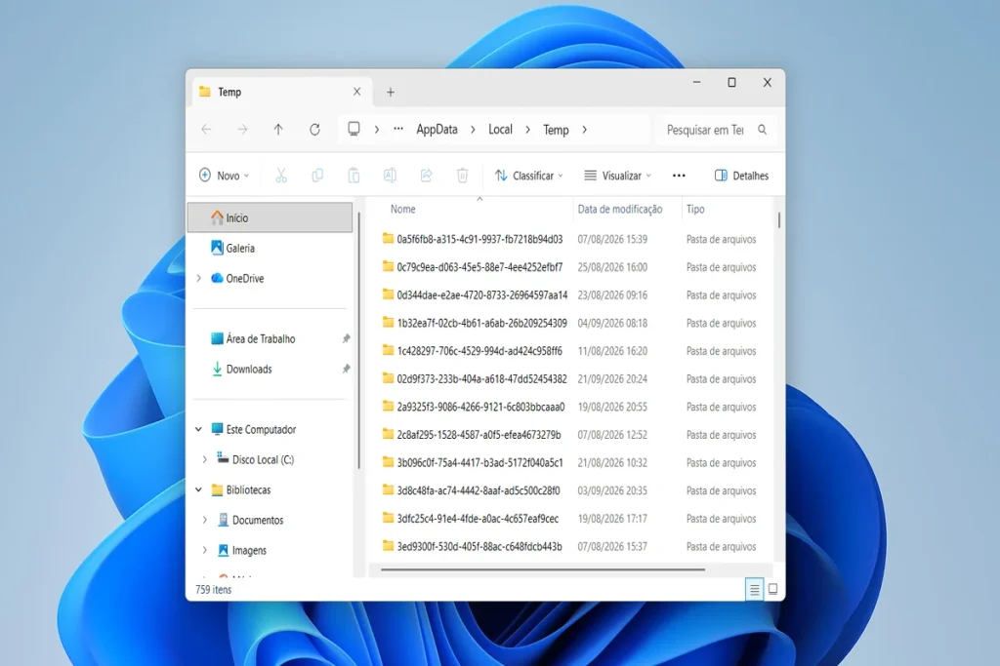
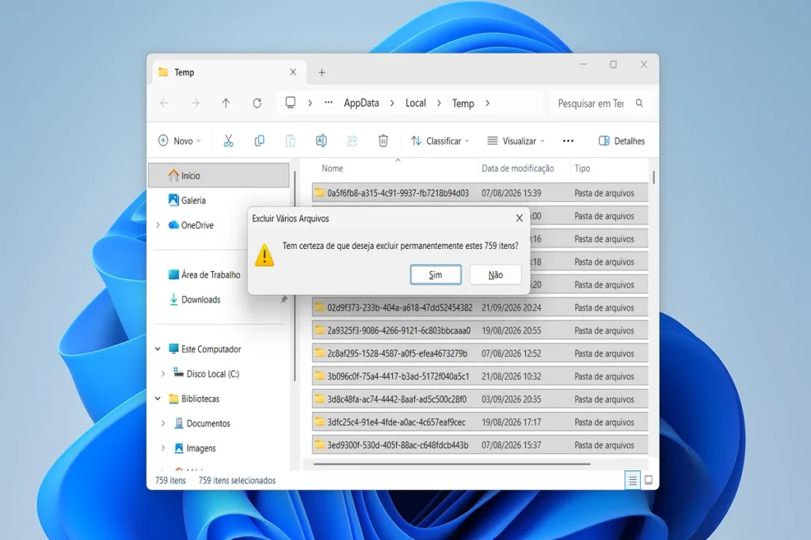
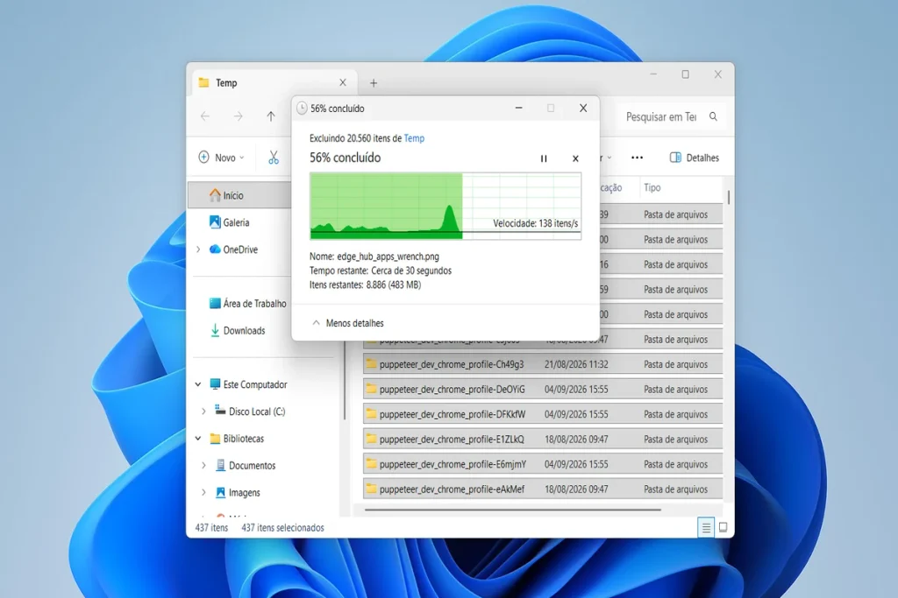

Para limpar arquivos temporários do Windows, basta usar o atalho %temp%, as Configurações de Armazenamento ou a Limpeza de Disco, sem instalar nenhum programa. O processo leva poucos minutos e pode liberar gigabytes de espaço no notebook.

## Por que os arquivos temporários deixam o notebook lento

Arquivos temporários são dados que o Windows e os programas criam para executar uma tarefa. Um editor de texto, por exemplo, guarda uma cópia provisória do documento enquanto você trabalha nele.

Esses arquivos deveriam sumir quando o programa fecha. No entanto, travamentos, atualizações interrompidas e instalações incompletas deixam muito lixo digital para trás.

Como resultado, o SSD (unidade de armazenamento) enche aos poucos. Com pouco espaço livre, o Windows perde margem para a memória virtual e para as próprias atualizações, e o sistema passa a responder mais devagar.

## Quanto espaço você recupera ao limpar a pasta Temp

Os números mostram por que vale a pena. Em um teste feito pelo TechOnPlay em um notebook com Windows 11, a pasta Temp acumulava **20.560 itens** entre arquivos e subpastas, muitos deles criados desde agosto, pouco mais de um mês antes.

Só os 8.886 arquivos que ainda faltavam apagar na metade do processo somavam **483 MB**. Somando a pasta Temp, os restos do Windows Update e o cache do navegador, a limpeza pode passar de **2 GB**, dependendo do uso do computador.

Esse espaço faz diferença real. Segundo a [Microsoft](https://support.microsoft.com/pt-br/windows/deployment/updates-lifecycle/free-up-space-for-windows-updates):

-   **Atualizações mensais** do Windows exigem de **2 GB a 3 GB** livres.
-   **Atualizações de recurso** (as grandes versões anuais) pedem de **6 GB a 11 GB** livres.

Ou seja, em notebooks de entrada com 128 GB ou 256 GB de armazenamento, liberar 2 GB pode ser a diferença entre o Windows se atualizar ou travar no meio do processo.

## Como limpar arquivos temporários do Windows com o atalho %temp%

O jeito mais rápido de apagar arquivos temporários é o atalho nativo %temp%. Siga os passos:

**1\. Abra a caixa Executar.** Pressione **Windows + R**, digite **%temp%** e clique em **OK**.

> 

**2\. Confira a pasta Temp.** O Windows abre a pasta no caminho AppData > Local > Temp, com todos os arquivos temporários do seu usuário.

> 

**3\. Selecione e exclua tudo.** Pressione **Ctrl + A** e, em seguida, **Shift + Delete** para apagar sem passar pela lixeira. Na janela de confirmação, clique em **Sim**.

> 

**4\. Aguarde a exclusão.** O Windows mostra o progresso, a velocidade e quantos itens faltam. Com milhares de arquivos, a tarefa leva cerca de um minuto.

> 

Alguns arquivos podem estar em uso por programas abertos. Nesse caso, marque a opção para aplicar a todos os itens e clique em **Ignorar**. Isso não afeta a limpeza do restante.

## Limpe pelas Configurações do Windows 11

O Windows 11 também reúne a limpeza em um painel próprio:

1.  Abra **Configurações** (Windows + I).
2.  Acesse **Sistema > Armazenamento > Arquivos temporários**.
3.  Marque os itens desejados e clique em **Remover arquivos**.

Atenção ao item **Downloads**: ele apaga a pasta de downloads inteira. Por isso, desmarque essa opção se guarda arquivos importantes lá.

Na mesma tela, ative o **Sensor de Armazenamento**. Esse recurso apaga arquivos temporários e esvazia a lixeira de forma automática, no intervalo que você escolher.

## Use a Limpeza de Disco para liberar mais espaço

A Limpeza de Disco alcança arquivos que o atalho %temp% não pega, como sobras de atualizações antigas:

1.  Digite **“Limpeza de Disco”** na busca do Windows e abra o programa.
2.  Escolha a unidade **C:** e clique em **OK**.
3.  Clique em **Limpar arquivos do sistema** para incluir restos do Windows Update.
4.  Marque os itens, clique em **OK** e confirme.

Por fim, limpe o cache do navegador. No Chrome e no Edge, o atalho **Ctrl + Shift + Delete** abre direto a tela de limpeza de dados de navegação.

## Dicas para manter o notebook sempre leve

A limpeza funciona melhor como hábito do que como ação única. Além disso, algumas medidas simples evitam que o problema volte:

-   **Desinstale programas sem uso:** muitos rodam em segundo plano e geram novos arquivos temporários.
-   **Revise os programas de inicialização:** no Gerenciador de Tarefas (Ctrl + Shift + Esc), desative o que não precisa abrir junto com o Windows.
-   **Mova fotos e vídeos antigos** para a nuvem ou para um HD externo.

## Perguntas frequentes

**É seguro apagar os arquivos da pasta %temp%?**

_Sim. Esses arquivos servem apenas para tarefas passageiras. O Windows bloqueia os que estão em uso, então não há risco de apagar algo essencial._

**Quanto espaço dá para liberar ao limpar arquivos temporários do Windows?**

_Depende do uso. Em notebooks sem manutenção há meses, a soma da pasta Temp, da Limpeza de Disco e do cache do navegador pode passar de 2 GB._

**Com que frequência devo fazer essa limpeza?**

_Uma vez por mês resolve para a maioria dos usuários. Com o Sensor de Armazenamento ativado, a limpeza passa a ser automática._

**Limpar arquivos temporários apaga meus documentos?**

_Não. A pasta %temp% não guarda fotos nem documentos pessoais. O cuidado maior fica com o item Downloads, nas Configurações de Armazenamento._

## Conclusão

Limpar arquivos temporários do Windows leva poucos minutos, não custa nada e devolve gigabytes ao notebook. Com o Sensor de Armazenamento ativado, essa manutenção passa a acontecer sozinha.

## Fontes:

-   [Microsoft Suporte: Liberar espaço para atualizações do Windows](https://support.microsoft.com/pt-br/windows/deployment/updates-lifecycle/free-up-space-for-windows-updates)
-   [Microsoft Suporte: Liberar espaço em disco no Windows](https://support.microsoft.com/pt-br/windows/free-up-drive-space-in-windows-85529ccb-c365-490d-b548-831022bc9b32)
