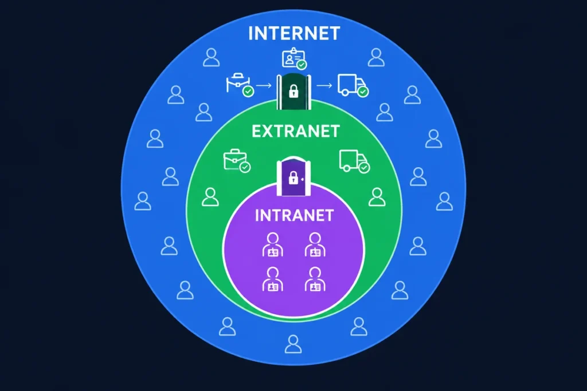
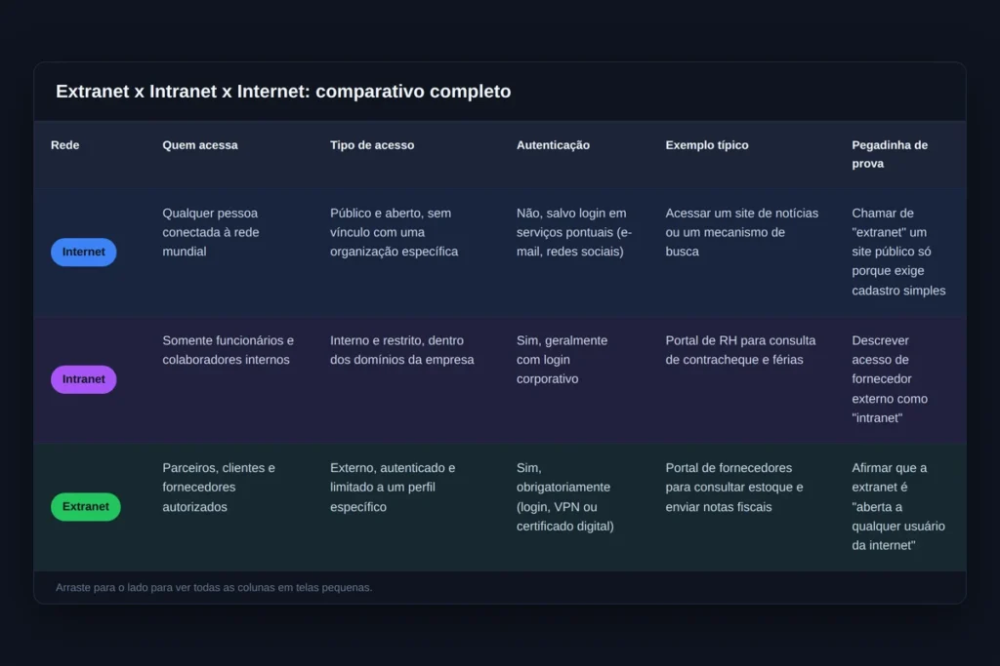

Você já parou para pensar em como uma empresa consegue dar acesso ao sistema interno para um fornecedor, sem abrir a rede inteira para qualquer pessoa? É exatamente aí que entra a extranet, um dos conceitos mais cobrados pelas bancas quando o assunto é redes de computadores.

## O que é extranet, na prática

Extranet é a extensão controlada da intranet de uma organização para pessoas de fora dela, como fornecedores, clientes ou parceiros comerciais. Diferentemente da intranet, que fica restrita aos funcionários, essa extensão libera uma parte específica da rede para quem tem uma relação direta com a empresa.

Segundo o glossário de segurança do NIST (CNSSI 4009-2022), esse tipo de rede é “uma rede de computadores que uma organização usa para o tráfego de dados de aplicações entre ela e seus parceiros de negócio”. Ou seja, o acesso nunca é livre: existe sempre um vínculo comercial por trás dele.

Guarde esta ideia: extranet não é sinônimo de acesso público. Antes de tudo, ela pressupõe uma relação previamente estabelecida entre a empresa e quem está do outro lado da conexão.

## Como funciona o acesso a essa rede corporativa externa

Na prática, essa rede funciona como uma porta lateral da intranet, aberta apenas para visitantes autorizados. Assim, o usuário externo recebe login e senha próprios, com permissões limitadas àquilo que ele realmente precisa enxergar.

Além disso, a empresa costuma usar VPN, certificados digitais ou portais web protegidos por HTTPS, que o parceiro acessa normalmente pelo [navegador](/buscador-e-navegador/) como qualquer outra página, para garantir que só o usuário autenticado chegue até os dados. Dessa forma, o restante da rede interna continua isolado, fora do alcance de quem entra por essa via.

Não confunda os dois conceitos: a extranet amplia o alcance da rede corporativa, mas não elimina o controle de acesso. Pelo contrário, ela depende dele para existir com segurança.

## Um exemplo real de uso

Imagine uma fábrica que cria um portal para seus fornecedores. Por meio dele, cada fornecedor consulta o estoque, acompanha pedidos em andamento e envia notas fiscais diretamente no sistema da empresa.

Esse fornecedor não tem acesso ao restante da rede interna, como o setor financeiro ou o RH. Ele enxerga somente a área da extranet liberada para o papel dele, o que ilustra bem o conceito de acesso segmentado por perfil.

## Vantagens e riscos da extranet para as empresas

Para a empresa, a extranet resolve um problema concreto: integrar parceiros ao fluxo de trabalho sem duplicar sistemas nem abrir a rede inteira. Dessa forma, fornecedores atualizam pedidos, clientes acompanham entregas e contadores consultam documentos, tudo dentro de um ambiente controlado, sem depender de e-mail ou telefone para cada solicitação.

Por outro lado, ampliar o acesso da rede também amplia a superfície de ataque. Por esse motivo, a extranet exige cuidados extras: perfis de acesso bem definidos, autenticação forte e monitoramento constante das conexões externas. Não é à toa que esse tipo de rede aparece também em questões de segurança da informação, não somente nas que cobram a classificação de redes.

## Extranet x intranet x internet: a diferença que a banca cobra

Por esse motivo, é fundamental separar bem os três conceitos antes da prova. A internet é aberta a qualquer pessoa no mundo. A intranet fica restrita ao público interno da organização. Já a extranet ocupa o meio-termo: parte da rede interna, liberada para um público externo específico e autenticado.

Aliás, essa classificação trata de quem pode acessar a rede, não do alcance geográfico dela. Não misture esse critério com a classificação de LAN, MAN e WAN, que trata de outra coisa: a distância física coberta pela rede.

## Pegadinhas de prova sobre esse tema

Cabe destacar que as bancas adoram testar esse conceito com afirmações absolutas. Se a questão disser que a extranet é “totalmente aberta ao público” ou que “qualquer usuário da internet pode acessá-la livremente”, desconfie: a afirmação está errada.

Outra pegadinha frequente inverte extranet e intranet, apostando na distração do candidato. Se a banca afirmar que essa rede serve exclusivamente ao público interno da empresa, marque a questão como incorreta, porque essa é justamente a definição de intranet.

Na sua prova, sempre relacione a extranet à ideia de parceria externa autenticada. Esse é um detalhe que costuma confundir o candidato, mas que se resolve com uma pergunta simples: quem está acessando tem vínculo direto com a empresa, e esse acesso passa por login?

## Perguntas frequentes sobre extranet

### **O que é extranet, resumindo em uma frase?**

_É a parte da rede de uma empresa liberada, mediante autenticação, para parceiros externos como fornecedores e clientes._

### **Extranet e VPN são a mesma coisa?**

_Não. Essa rede define quem pode acessar o sistema da empresa; a VPN é apenas uma das tecnologias usadas para tornar esse acesso seguro._

### **Em que tipo de questão esse tema mais aparece?**

_Ele costuma cair em comparações com intranet e internet, quando a banca descreve um cenário e pede para você identificar o tipo de rede envolvido._

### **Preciso saber configurar esse tipo de rede para a prova?**

_Não. As bancas cobram o conceito, quem acessa e o tipo de autenticação exigida, não os detalhes técnicos de implementação._

## Para fechar

Em resumo, a extranet resolve um problema real das empresas: como compartilhar informações com quem está fora dos seus muros, sem abrir mão do controle. Ela une exatamente esses dois pontos, alcance externo e autenticação obrigatória.

Agora que o conceito está claro, aproveite para revisar internet e intranet no [artigo completo sobre os três conceitos](/internet-intranet-extranet/) e treine a diferenciação entre eles no [simulado de redes de computadores](/redes-de-computadores-para-concursos/). Se ainda tiver dúvidas sobre a estrutura geral das redes, vale revisitar o [guia de redes de computadores para concursos](/redes-de-computadores-guia-completo/) antes de avançar para o próximo tópico.

Para fixar esse conteúdo, resolva agora as questões comentadas logo abaixo. Elas seguem o estilo das principais bancas e ajudam você a identificar, na prática, se o conceito de extranet já está bem consolidado.

CEBRASPECerto ou Errado

A extranet é uma rede totalmente aberta ao público, podendo ser acessada livremente por qualquer usuário conectado à internet, sem necessidade de autenticação.

CERTO ERRADO

Resposta correta: ERRADO

O acesso à extranet sempre exige autenticação e depende de uma relação comercial prévia entre a empresa e o parceiro externo. Rede aberta a qualquer pessoa, sem login, é a definição de internet.

FCCMúltipla escolha

Uma indústria disponibiliza, para seus fornecedores cadastrados, um portal autenticado onde eles consultam estoque e enviam notas fiscais. Esse portal, restrito a parceiros externos autorizados, caracteriza uma:

A) Internet B) Extranet C) Intranet D) LAN

Resposta correta: B) Extranet

O acesso liberado a fornecedores externos, com autenticação e permissões limitadas, é a definição clássica de extranet. Intranet ficaria restrita aos funcionários da própria indústria.

FGVCerto ou Errado

A extranet permite que colaboradores internos acessem, exclusivamente, os sistemas corporativos restritos à própria empresa, sem qualquer interação com usuários externos.

CERTO ERRADO

Resposta correta: ERRADO

Essa é a definição de intranet, não de extranet. A extranet existe justamente para abrir uma parte da rede a parceiros externos autenticados, como fornecedores e clientes.

VUNESPMúltipla escolha

Um banco libera, mediante login e senha, uma área do seu sistema para que escritórios de contabilidade parceiros consultem extratos de clientes autorizados. Essa liberação de acesso caracteriza:

A) Uma WAN B) Uma intranet C) Uma extranet D) Uma internet

Resposta correta: C) Uma extranet

Acesso autenticado, liberado a um parceiro externo específico, é a marca registrada da extranet. WAN e LAN classificam alcance geográfico, um critério diferente e que não deve ser confundido com este.

IADESCerto ou Errado

O acesso a uma extranet dispensa qualquer mecanismo de autenticação, bastando que o usuário externo esteja conectado à mesma rede física da empresa.

CERTO ERRADO

Resposta correta: ERRADO

Estar na mesma rede física não basta. A extranet exige autenticação (login, senha, VPN ou certificado digital), justamente porque conecta a empresa a usuários de fora dos seus domínios.

IBFCCerto ou Errado

A extranet é uma extensão da intranet que permite a parceiros externos, como fornecedores e clientes, acessarem, de forma autenticada, uma parte específica da rede corporativa.

CERTO ERRADO

Resposta correta: CERTO

A definição está correta: a extranet estende parte da intranet a um público externo autorizado, sempre com autenticação e permissões limitadas ao que esse parceiro precisa acessar.

CESGRANRIOMúltipla escolha

Uma empresa disponibiliza, para escritórios de contabilidade parceiros, uma área do seu sistema financeiro, acessível somente mediante certificado digital. Essa solução caracteriza uma:

A) Intranet B) LAN C) Extranet D) Internet E) WAN

Resposta correta: C) Extranet

O uso de certificado digital para autenticar um parceiro externo específico é típico de extranet. LAN e WAN classificam alcance geográfico, não quem acessa a rede.

AOCPCerto ou Errado

Ampliar o acesso da rede corporativa por meio de uma extranet aumenta a superfície de ataque da organização, o que exige controles adicionais de autenticação e monitoramento.

CERTO ERRADO

Resposta correta: CERTO

Correto. Quanto mais pontos de acesso externo uma rede tem, maior o risco de exploração. Por isso a extranet depende de perfis de acesso bem definidos e de monitoramento constante das conexões.

CEBRASPEMúltipla escolha

Em uma extranet, o acesso de parceiros externos à rede corporativa ocorre, tipicamente, por meio de:

A) Endereço IP público sem restrições B) Rede Wi-Fi aberta da empresa C) Login, VPN ou certificado digital D) Compartilhamento de arquivos sem senha

Resposta correta: C) Login, VPN ou certificado digital

A extranet sempre depende de algum mecanismo de autenticação, como login e senha, VPN ou certificado digital. Sem isso, a rede deixa de ser uma extranet e passa a ser um acesso público comum.

FGVCerto ou Errado

Basta que o parceiro externo esteja conectado à internet para acessar automaticamente a extranet de uma empresa, sem qualquer processo de autenticação prévio.

CERTO ERRADO

Resposta correta: ERRADO

Estar conectado à internet não dá acesso automático a nada. A extranet exige um processo de autenticação prévio, vinculado a uma relação comercial já estabelecida com a empresa.

## Fontes e Referências

-   NIST Computer Security Resource Center, glossário, termo “Extranet” (CNSSI 4009-2022)
-   IETF RFC 4949 Ver. 2, Internet Security Glossary

-   
    
    [Cebraspe: como funciona a banca e o que ela cobra em Informática](/cebraspe-como-funciona-a-banca-e-o-que-ela-cobra-em-informatica/)
-   
    
    [Como Estudar para Concurso Faltando Menos de 15 Dias para a Prova](/como-estudar-para-concurso/)
-   
    
    [Informática para concursos: 5 confusões clássicas e como a banca as cobra](/informatica-para-concursos-5-duvidas-prova/)
-   
    
    [10 dicas para gabaritar a prova de Informática da Cebraspe PM MA 2026](/informatica-cebraspe-pm-ma-2026/)
-   
    
    [Windows 10: Guia Completo para Concursos Públicos](/windows-10-para-concursos/)
