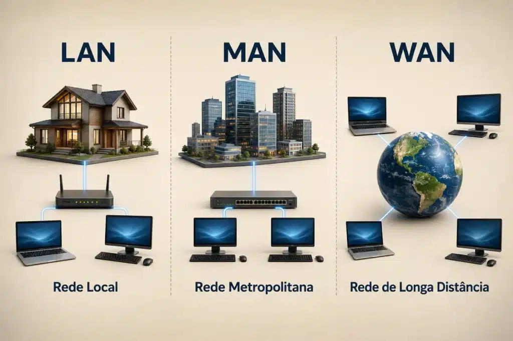
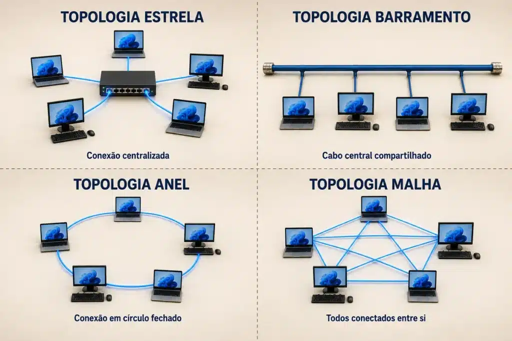

Você já parou para pensar em como um simples clique consegue levar sua mensagem até o outro lado do mundo em poucos segundos? Por trás dessa simplicidade aparente, existe uma estrutura complexa de equipamentos, protocolos e regras que chamamos de redes de computadores. E, para quem estuda para concurso público, esse é um dos assuntos mais recorrentes nas provas de Informática — então, vale a pena entender cada detalhe com calma.

Ao longo deste guia, vamos destrinchar os conceitos que mais aparecem em prova: os tipos de rede, os componentes físicos e lógicos, os modelos de referência OSI e TCP/IP, as topologias e, claro, as pegadinhas favoritas das bancas. Prepare-se, porque alguns detalhes parecem simples à primeira vista, mas costumam derrubar quem não presta atenção.

## O que é uma Rede de Computadores?

Uma rede de computadores reúne um conjunto de dispositivos interligados que trocam dados e compartilham recursos entre si. Esses dispositivos — que chamamos de hosts ou nós — utilizam protocolos de comunicação para transmitir informações por meios físicos, como cabos, ou por meios sem fio, como ondas de rádio.

Na prática, o objetivo central de qualquer rede envolve a otimização de recursos. Por exemplo, em vez de cada usuário comprar sua própria impressora, a rede permite que vários computadores compartilhem um único equipamento, principalmente em ambientes com orçamento limitado. Da mesma forma, um servidor centraliza o armazenamento de arquivos e, assim, facilita tanto a segurança quanto o acesso remoto aos dados.

Aqui vai um ponto que merece atenção: o conceito de rede abrange desde duas máquinas conectadas por um cabo até a própria internet, que representa, hoje, a maior rede de computadores já criada. Por isso, quando a banca perguntar “o que é uma rede de computadores”, desconfie de alternativas que limitam o conceito a “computadores em um mesmo prédio” — essa é uma pegadinha clássica.

## Por que esse tema aparece tanto nas provas?

As principais bancas — Cebraspe, FGV, FCC, IBFC, Vunesp e AOCP, entre outras — cobram redes de computadores porque o assunto conecta teoria e aplicação prática do dia a dia do servidor público. Além disso, cada banca tem um estilo próprio de cobrança, e conhecer esse padrão ajuda bastante na hora de interpretar o enunciado.

O Cebraspe, por exemplo, costuma usar o formato certo ou errado e explora justamente os pequenos deslizes conceituais — trocar “roteador” por “switch”, ou confundir LAN com WAN. A FGV, por sua vez, prefere questões de múltipla escolha que testam a compreensão de cenários práticos, enquanto a FCC tende a cobrar definições mais literais, próximas do que aparece em livros-texto. Já o IBFC e a Vunesp costumam equilibrar teoria e aplicação, com questões diretas sobre conceitos e siglas.

Justamente por isso, não adianta decorar definições isoladas: você precisa entender o raciocínio por trás de cada conceito para reconhecer a “casca” da pegadinha, não importa a banca.

## Tipos de Redes de Computadores por Abrangência

A classificação mais cobrada em prova organiza as redes de computadores conforme sua extensão geográfica. Vamos destrinchar cada uma a seguir e, se quiser se aprofundar ainda mais nesse ponto, vale a pena conferir também o guia completo sobre [tipos de redes de computadores para concursos](/tipos-redes-computadores-concursos/).

### Rede de Área Local (LAN)

A LAN (Local Area Network) conecta dispositivos dentro de um espaço físico limitado, como uma casa, um escritório ou um único prédio. No início, essas redes usavam cabos coaxiais; hoje, no entanto, predominam as conexões Ethernet e Wi-Fi.

### Rede de Área Metropolitana (MAN)

A MAN (Metropolitan Area Network) cobre uma área maior que a LAN, como um campus universitário ou um bairro inteiro. Frequentemente, empresas utilizam esse tipo de rede para interligar filiais dentro de uma mesma cidade — não confunda esse alcance intermediário com o de uma WAN, porque essa troca é queridinha das bancas.

### Rede de Área Ampla (WAN)

A WAN (Wide Area Network) se estende por grandes distâncias geográficas e conecta países ou até continentes inteiros. A internet representa o exemplo mais notável de WAN. Para isso funcionar, as empresas alugam linhas de telecomunicações de operadoras, já que nenhuma entidade sozinha possui toda a infraestrutura física necessária.

### Rede de Área Pessoal (PAN)

Por fim, a PAN (Personal Area Network) foca na comunicação entre dispositivos próximos a uma única pessoa — pense na conexão entre seu smartphone e um fone de ouvido via Bluetooth. Guarde esta ideia: o alcance curtíssimo é justamente o que diferencia a PAN das demais categorias.

## Internet, Intranet e Extranet: Cuidado para Não Confundir com LAN, MAN, WAN e PAN

Aqui entra uma pegadinha que aparece com frequência nas provas: internet, intranet e extranet não classificam a rede pela abrangência geográfica, como fazem LAN, MAN, WAN e PAN. Elas classificam a rede, na verdade, pelo critério de acesso e propriedade — ou seja, quem pode entrar e quem administra a estrutura. Não confunda os dois critérios: eles respondem perguntas diferentes.

A **internet** representa a rede pública mundial, sem dono único, formada pela interconexão de milhares de redes menores ao redor do planeta. Qualquer pessoa com uma conexão consegue acessá-la, e nenhuma entidade isolada controla toda a sua infraestrutura.

A **intranet,** por outro lado, funciona como uma rede privada, voltada aos usuários internos de uma organização. Ela utiliza os mesmos protocolos da internet, especialmente o TCP/IP, mas apenas os funcionários conseguem acessá-la, geralmente mediante login e senha. Empresas costumam usar a intranet para compartilhar documentos internos, sistemas corporativos e comunicados que não devem circular fora do ambiente institucional.

Já a **extranet** estende parte da intranet para além dos muros da empresa e permite que parceiros externos autorizados — fornecedores, clientes ou prestadores de serviço — acessem informações específicas, também mediante autenticação. Assim, a extranet funciona como uma ponte controlada entre a rede interna da organização e o mundo externo.

Guarde esta ideia para a prova: LAN, MAN, WAN e PAN respondem “**até onde a rede alcança**“; internet, intranet e extranet respondem “**quem pode acessar a rede**“. Sempre que a banca misturar os dois critérios na mesma alternativa, desconfie.

## Componentes Essenciais de uma Rede

Para que a comunicação aconteça sem falhas, vários elementos atuam em conjunto. Confira os principais:

-   **Dispositivos finais (hosts):** computadores, servidores, impressoras e smartphones que originam ou recebem dados.
-   **Roteadores:** direcionam o tráfego entre redes diferentes e operam na camada de rede.
-   **Switches:** conectam múltiplos dispositivos dentro de uma mesma rede local e atuam na camada de enlace.
-   **Hubs:** replicam o sinal para todas as portas, sem inteligência alguma, e funcionam apenas na camada física.
-   **Meios de transmissão:** cabos de par trançado, fibra óptica e o espectro de radiofrequência, no caso das redes sem fio.
-   **Protocolos:** conjuntos de regras padronizadas, como o TCP/IP, que definem como os dados se formatam, se transmitem e chegam ao destino.

Aqui está uma pegadinha frequente: a banca troca “roteador” por “switch” ou “hub” na mesma frase, esperando que você não perceba a diferença de camada e de função. Portanto, memorize bem: hub replica, switch direciona dentro da rede local, e roteador direciona entre redes diferentes.

Além dos componentes físicos, o software de rede — sistemas operacionais e aplicativos — também entra em cena e gerencia toda a lógica de comunicação entre esses elementos.

## Modelos de Referência: OSI e TCP/IP

Entender como os dados viajam pela rede exige o estudo de modelos organizados em camadas. Esses modelos dividem um processo complexo em etapas menores e, assim, mais fáceis de estudar — e de cobrar em prova.

### Modelo OSI

O modelo OSI (Open Systems Interconnection) organiza a comunicação em sete camadas, e cada uma cumpre uma função específica:

1.  **Física** — transmite o bit pelo meio físico.
2.  **Enlace** — controla o acesso ao meio e trata o endereçamento físico (MAC).
3.  **Rede** — cuida do roteamento e do endereçamento lógico (IP).
4.  **Transporte** — garante o controle de fluxo e a confiabilidade (TCP/UDP).
5.  **Sessão** — gerencia as sessões entre aplicações.
6.  **Apresentação** — traduz e criptografa os dados.
7.  **Aplicação** — faz a interface com o software do usuário.

Um macete que ajuda bastante: monte uma frase com a inicial de cada camada, na ordem física, enlace, rede, transporte, sessão, apresentação e aplicação — afinal, decorar a sequência evita boa parte dos erros nessa parte da prova.

### Modelo TCP/IP

Por outro lado, o modelo TCP/IP — o que realmente funciona na internet — condensa essas sete camadas em apenas quatro: acesso à rede, internet, transporte e aplicação. Embora possua menos camadas, ele cumpre funções equivalentes às do modelo OSI e garante a interoperabilidade global da rede.

Esse é um detalhe que costuma confundir o candidato: o modelo OSI funciona como referência teórica e didática, ou seja, um mapa conceitual, enquanto o TCP/IP representa o modelo efetivamente implementado na internet. Não troque um pelo outro na hora da prova.

## Topologias de Rede Mais Cobradas em Concurso

A topologia define como os dispositivos se conectam, seja física, seja logicamente, e essa escolha impacta diretamente o desempenho e a tolerância a falhas da rede. Para revisar esse ponto com mais exemplos e questões comentadas, confira também o artigo dedicado sobre [topologias de rede para concursos](/topologias-de-rede-concursos/).

-   **Barramento:** todos os dispositivos compartilham um único cabo central. Se o cabo rompe, a rede inteira para de funcionar.
-   **Estrela:** cada dispositivo se conecta a um nó central, normalmente um switch. Essa configuração facilita a manutenção, porque isola falhas individuais sem derrubar a rede toda.
-   **Anel:** os dados percorrem um círculo, passando por cada nó até chegar ao destino.
-   **Malha:** os dispositivos se interconectam de forma redundante. Essa estrutura garante alta confiabilidade e, por isso, aparece com frequência nos backbones da internet.

Na prática, a topologia em estrela se tornou a mais popular em ambientes corporativos, já que oferece boa escalabilidade e facilidade de gerenciamento. Ainda assim, não deixe de revisar as demais, porque as bancas adoram perguntar qual topologia falha por completo diante do rompimento de um único cabo — e a resposta, nesse caso, é o barramento.

## Segurança em Redes de Computadores

Conforme a dependência das redes de computadores cresce, a segurança da informação ganha ainda mais peso nas provas. No início, a proteção se concentrava apenas em firewalls; hoje, entretanto, envolve múltiplas camadas de defesa.

As ameaças mais cobradas incluem malwares, ataques de negação de serviço (DDoS) e interceptação de dados. Para reduzir esses riscos, os administradores de rede aplicam criptografia, autenticação robusta e segmentação da rede em sub-redes menores.

Consequentemente, a segurança deixa de ser um simples produto instalado uma vez e passa a ser um processo contínuo, que exige atualização constante de protocolos e conscientização dos usuários. Guarde essa ideia, porque ela costuma aparecer em questões conceituais sobre segurança da informação.

## Quadro-Resumo para Revisar Antes da Prova

Antes de fechar o assunto, vale organizar mentalmente o que realmente importa memorizar:

-   LAN, MAN, WAN e PAN se diferenciam pela abrangência geográfica, do menor para o maior alcance: PAN, LAN, MAN e WAN.
-   Internet, intranet e extranet não seguem esse mesmo critério: elas classificam a rede pelo acesso e pela propriedade, não pela distância.
-   Hub opera na camada física, switch na camada de enlace e roteador na camada de rede.
-   O modelo OSI tem sete camadas; o TCP/IP, apenas quatro.
-   A topologia estrela isola falhas; a topologia em barramento falha por completo se o cabo se rompe.
-   Segurança de rede é processo contínuo, não uma solução única.

## Questão Comentada, no Estilo das Bancas

Veja um exemplo de questão no estilo Cebraspe, para você treinar o raciocínio:

_“O roteador atua na camada de enlace do modelo OSI e tem como função conectar múltiplos dispositivos dentro de uma mesma rede local.”_

Essa afirmação está errada, e o erro mora exatamente onde a banca espera que você não perceba: o roteador atua na camada de rede, não na de enlace, e a função de conectar dispositivos dentro da mesma rede local pertence ao switch. Perceba como a banca embaralha dois conceitos corretos, mas atribui cada um ao dispositivo errado. Esse tipo de armadilha aparece o tempo todo; então, releia o quadro-resumo sempre que sentir insegurança sobre esses detalhes.

## Considerações Finais

Redes de computadores exigem atenção aos detalhes, e não apenas a decoreba de siglas. Quando você entende o raciocínio por trás de cada conceito — por que existe uma camada de transporte, por que a topologia em estrela isola falhas, por que o roteador difere do switch —, fica muito mais fácil identificar a pegadinha, não importa qual banca organize a prova.

Releia este guia sempre que sentir dúvida sobre algum ponto específico e, sempre que possível, resolva questões de provas anteriores para testar o que você aprendeu aqui. Esse é o caminho mais direto entre a teoria e a aprovação.

## Fontes e Referências

-   Cisco Networking Academy: Introduction to Networks.
-   Kurose, J. F., & Ross, K. W.: Computer Networking: A Top-Down Approach. Pearson.
-   Tanenbaum, A. S.: Redes de Computadores. Prentice-Hall.
-   Cloudflare: What is a computer network?

📚 Mais conteúdos de Informática para concursos: fernandolisboa.pro

-   
    
    [Cebraspe: como funciona a banca e o que ela cobra em Informática](/cebraspe-como-funciona-a-banca-e-o-que-ela-cobra-em-informatica/)
-   
    
    [Como Estudar para Concurso Faltando Menos de 15 Dias para a Prova](/como-estudar-para-concurso/)
-   
    
    [Informática para concursos: 5 confusões clássicas e como a banca as cobra](/informatica-para-concursos-5-duvidas-prova/)
-   
    
    [10 dicas para gabaritar a prova de Informática da Cebraspe PM MA 2026](/informatica-cebraspe-pm-ma-2026/)
-   
    
    [Windows 10: Guia Completo para Concursos Públicos](/windows-10-para-concursos/)
