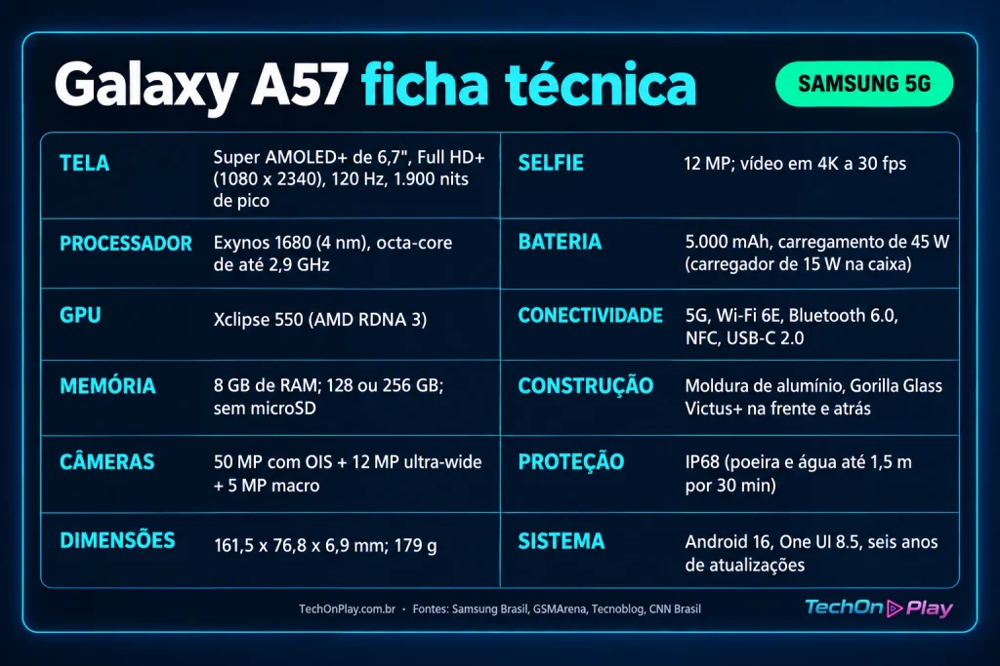

O **Galaxy A57** chegou ao Brasil em abril de 2026 como o intermediário mais fino da Samsung. Este review reúne a ficha técnica completa, compara o modelo com o A56 e o A55 e mostra se ele compensa hoje, com preços bem abaixo do lançamento.

## Ficha técnica do Galaxy A57

## Galaxy A57 vs A56 vs A55: o que mudou

Para começar, a tabela mostra a evolução em três gerações da linha.

| Item | Galaxy A55 (2024) | Galaxy A56 (2025) | Galaxy A57 (2026) |
| --- | --- | --- | --- |
| Tela | 6,6″, 1.000 nits | 6,7″, 1.900 nits | 6,7″, 1.900 nits, Super AMOLED+ |
| Chip | Exynos 1480 | Exynos 1580 | Exynos 1680 |
| GPU | Xclipse 530 | Xclipse 540 | Xclipse 550 (RDNA 3) |
| Espessura e peso | 8,2 mm; 213 g | 7,4 mm; 198 g | 6,9 mm; 179 g |
| Proteção | IP67 | IP67 | IP68 |
| Câmera principal | 50 MP com OIS | 50 MP com OIS | 50 MP com OIS |
| Câmera frontal | 32 MP | 12 MP | 12 MP |
| Bateria | 5.000 mAh | 5.000 mAh | 5.000 mAh |
| Carregamento | 25 W | 45 W | 45 W |
| Cartão microSD | Sim | Não | Não |
| Wi-Fi | Wi-Fi 6 | Wi-Fi 6 | Wi-Fi 6E |
| Sistema de fábrica | Android 14 | Android 15 | Android 16, One UI 8.5 |
| Atualizações | 4 anos | 6 anos | 6 anos |

Em verde, o que mudou em relação ao Galaxy A56. Fontes: Samsung Brasil, GSMArena, Tecnoblog, Oficina da Net e CNN Brasil.

O A57 evolui em design, proteção, chip e Wi-Fi. Por outro lado, bateria, câmeras e carregamento seguem iguais aos do A56. Vale destacar que o A57 é 0,5 mm mais fino e 19 g mais leve que o antecessor, segundo a [CNN Brasil](https://www.cnnbrasil.com.br/tecnologia/galaxy-a57-e-a37-sao-lancados-oficialmente-no-brasil-confira-detalhes/).

## Review Galaxy A57: desempenho, câmeras e bateria

**Desempenho.** O Exynos 1680 avança pouco sobre o 1580. Para redes sociais, streaming e jogos leves, ele entrega fluidez sem aquecimento excessivo. Em jogos pesados, rivais como o POCO X8 Pro rendem mais, segundo o Oficina da Net.

**Câmeras.** O conjunto repete o do A56 e não tem teleobjetiva. As fotos com boa luz agradam, e o vídeo chega a 4K a 30 quadros por segundo.

**Bateria.** No teste do Oficina da Net, o A57 durou 7h45 de tela ligada e terminou com 22% de carga. O carregador da caixa tem só 15 W, e a recarga completa levou quase duas horas. Outra análise, do 4gnews, mediu entre 1h e 1h10. Portanto, quem quer os 45 W precisa comprar um carregador compatível.

## Preço do Galaxy A57 no Brasil

No lançamento, a Samsung cobrava R$ 3.599 pela versão de 128 GB e R$ 3.999 pela de 256 GB. A versão de entrada custava R$ 600 a mais que a do A56, que estreou a R$ 2.999.

Hoje, o monitor de preços do Oficina da Net registra o 128 GB perto de R$ 1.700 e o 256 GB perto de R$ 2.300. Os valores variam por loja, então compare antes de comprar.

## Vale a pena comprar o Galaxy A57?

Sim, se o preço ficar perto de R$ 2 mil. Nessa faixa, o aparelho oferece tela excelente, design premium, IP68 e seis anos de suporte. O Oficina da Net deu nota 8,3 de 10.

Ao preço de lançamento, a resposta muda para não, porque o ganho sobre o A56 é discreto. Em resumo, este review conclui que o **Galaxy A57** é um bom celular que só compensa com desconto. Com o preço em queda, a disputa agora acontece contra rivais com bateria maior e carga mais rápida.

Quer comparar alternativas? Leia também: **\[inserir título e link de outro artigo do site\]**.

## Perguntas frequentes sobre o Galaxy A57

**O Galaxy A57 vale a pena em 2026?**

_Vale, desde que o preço fique próximo de R$ 2 mil. Ao valor de lançamento, o custo-benefício é fraco._

**Qual a diferença entre o Galaxy A57 e o A56?**

_O A57 é mais fino e leve, tem IP68, Exynos 1680 e Wi-Fi 6E. Bateria e câmeras ficaram iguais._

**O Galaxy A57 tem carregamento sem fio?**

_Não. Ele carrega apenas por cabo, com até 45 W._

**O Galaxy A57 aceita cartão microSD?**

_Não. O aparelho não tem slot para cartão de memória_
