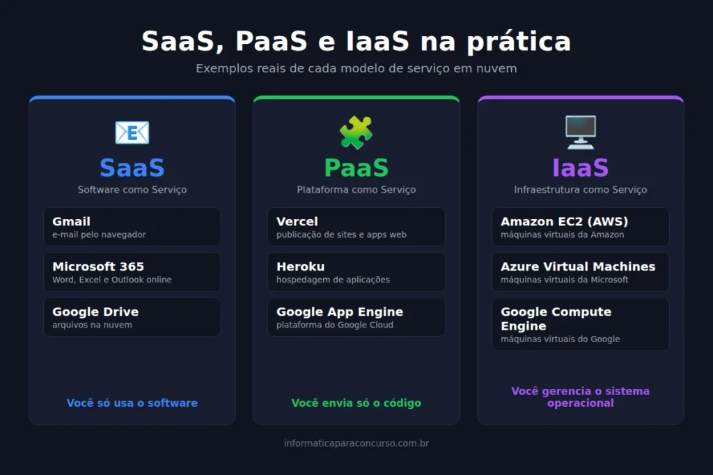
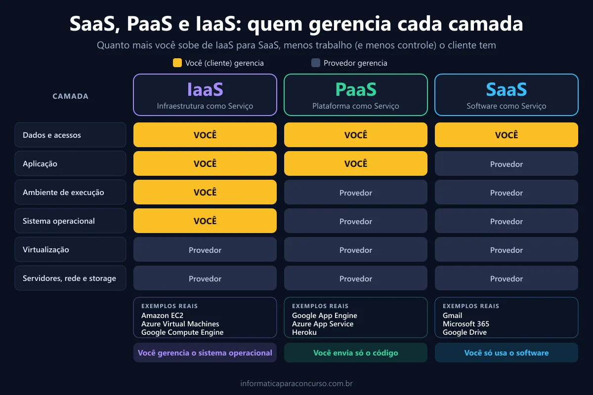

Poucos assuntos de computação em nuvem aparecem tanto em prova quanto **SaaS, PaaS e IaaS**. Além disso, a banca raramente pergunta só o significado da sigla. Ela quer saber quem gerencia o quê, e é justamente aí que o candidato perde pontos.

Por isso, vou mostrar o conceito de cada modelo, exemplos reais, uma tabela comparativa e as **pegadinhas** mais comuns. No final, você testa o conhecimento com 10 questões comentadas.

## O que são os modelos de serviço em nuvem

Primeiramente, entenda a lógica. Na nuvem, você contrata recursos computacionais de um provedor em vez de manter tudo na sua própria sala de servidores. Se quiser revisar a base do tema, veja o nosso artigo sobre [armazenamento em nuvem](/cloud-storage-armazenamento-de-dados-na-nuvem/).

O NIST, órgão de padronização dos Estados Unidos, define três modelos de serviço na publicação SP 800-145. A diferença entre eles está no quanto o provedor gerencia e no quanto sobra para o cliente. Ou seja, cada modelo divide as responsabilidades de um jeito.

Guarde esta ideia: quanto mais você sobe de IaaS para SaaS, menos controle o cliente tem e menos trabalho ele assume.

## IaaS: infraestrutura como serviço

Inicialmente, pense no nível mais baixo. No IaaS (Infrastructure as a Service), o provedor entrega processamento, armazenamento e [rede](/redes-de-computadores-para-concursos/). Em outras palavras, você aluga uma máquina virtual e faz o resto.

Dessa forma, o cliente instala e gerencia o sistema operacional, as aplicações e os dados. Por outro lado, o provedor cuida do hardware físico, da virtualização e do data center.

Exemplos clássicos:

-   Amazon EC2
-   Microsoft Azure Virtual Machines
-   Google Compute Engine

Aqui está um ponto que merece atenção: no IaaS, **o cliente controla o sistema operacional**. As bancas adoram perguntar isso.

## PaaS: plataforma como serviço

Na sequência, subimos um degrau. No PaaS (Platform as a Service), o provedor entrega um ambiente pronto para desenvolver e hospedar aplicações. Assim, o desenvolvedor foca apenas no código.

Nesse modelo, o cliente implanta suas aplicações e gerencia os dados. No entanto, ele não administra servidores, rede, armazenamento nem sistema operacional. O provedor assume toda essa camada.

Exemplos:

-   Google App Engine
-   Azure App Service
-   Heroku

Esse é um detalhe que costuma confundir o candidato. Se a questão afirmar que, no PaaS, o cliente gerencia o sistema operacional, marque errado.

## SaaS: software como serviço

Por fim, chegamos ao topo. No SaaS (Software as a Service), você usa uma aplicação completa pela internet, geralmente pelo [navegador](/buscador-e-navegador/). Não instala nada no servidor e não programa nada.

Consequentemente, o provedor gerencia tudo: infraestrutura, plataforma e a própria aplicação. O usuário ajusta, no máximo, configurações pessoais, como preferências da conta.

Você usa SaaS todos os dias:

-   Gmail
-   Microsoft 365
-   Google Drive
-   Dropbox

## SaaS, PaaS e IaaS lado a lado

Agora, compare os três modelos na mesma tela. Na prova, a banca pode explorar justamente essa diferença de responsabilidades.

### Tabela comparativa

☁️ SaaS, PaaS e IaaS: quem gerencia cada camada

   
| Camada | 🖥️ IaaS | 🧩 PaaS | 📧 SaaS |
| --- | --- | --- | --- |
| Dados e acessos | Cliente | Cliente | Cliente |
| Aplicação | Cliente | Cliente | Provedor |
| Ambiente de execução | Cliente | Provedor | Provedor |
| Sistema operacional | Cliente | Provedor | Provedor |
| Virtualização | Provedor | Provedor | Provedor |
| Servidores, rede e storage | Provedor | Provedor | Provedor |
| Exemplos | EC2, Azure VM | App Engine, Heroku | Gmail, Microsoft 365 |

💡 Dica de prova: se o cliente gerencia o sistema operacional, o modelo é IaaS.

### A analogia que ajuda a memorizar

Na prática, funciona assim com o transporte:

-   **IaaS** é alugar um carro: o veículo é do locador, mas você dirige, abastece e escolhe o caminho.
-   **PaaS** é contratar um carro com motorista: você só diz para onde quer ir.
-   **SaaS** é pegar um ônibus: tudo já está pronto, e você apenas usa o serviço.

## Como a banca cobra SaaS, PaaS e IaaS

Antes de tudo, fique atento a três armadilhas recorrentes.

A primeira troca as responsabilidades. A banca atribui ao cliente do PaaS a gestão do sistema operacional, ou diz que o usuário de SaaS administra a infraestrutura. Ambas as afirmações estão erradas.

A segunda mistura categorias. Não confunda os dois conceitos: SaaS, PaaS e IaaS são **modelos de serviço**, enquanto nuvem pública, privada, híbrida e comunitária são **modelos de implantação**. Se o item disser que “nuvem híbrida é um modelo de serviço”, está errado.

A terceira usa palavras absolutas. No estilo [Cebraspe](/cebraspe-como-funciona-a-banca-e-o-que-ela-cobra-em-informatica/), termos como “sempre”, “somente” e “exclusivamente” costumam indicar erro. Por exemplo: “No IaaS, o provedor gerencia exclusivamente o sistema operacional” está errado, porque quem gerencia o sistema operacional é o cliente.

É aqui que aparece uma das principais **pegadinhas**: a banca descreve um cenário e pede o modelo. Então identifique o que o cliente controla. Se ele controla o sistema operacional, é IaaS. Se controla só o código, é PaaS. Se apenas usa o software, é SaaS.

## Conclusão

Em resumo, **SaaS, PaaS e IaaS** diferem pela divisão de responsabilidades entre provedor e cliente. O IaaS entrega infraestrutura, o PaaS entrega plataforma e o SaaS entrega o software pronto.

Portanto, memorize este ponto: quem gerencia o sistema operacional define boa parte das respostas. Agora resolva as questões abaixo e, em seguida, avance para os modelos de implantação e as características essenciais da nuvem, que costumam cair no mesmo item do edital.

## Fontes e referências

-   MELL, Peter; GRANCE, Timothy. [The NIST Definition of Cloud Computing (SP 800-145)](https://csrc.nist.gov/pubs/sp/800/145/final). NIST, 2011.
-   Microsoft. [Responsabilidade compartilhada na nuvem](https://learn.microsoft.com/pt-br/azure/security/fundamentals/shared-responsibility). Microsoft Learn.
-   Amazon Web Services. [Types of Cloud Computing](https://aws.amazon.com/types-of-cloud-computing/). AWS.
-   Google Cloud. [PaaS vs. IaaS vs. SaaS vs. CaaS](https://cloud.google.com/learn/paas-vs-iaas-vs-saas). Google Cloud.

-   
    
    [Cebraspe: como funciona a banca e o que ela cobra em Informática](/cebraspe-como-funciona-a-banca-e-o-que-ela-cobra-em-informatica/)
-   
    
    [Como Estudar para Concurso Faltando Menos de 15 Dias para a Prova](/como-estudar-para-concurso/)
-   
    
    [Informática para concursos: 5 confusões clássicas e como a banca as cobra](/informatica-para-concursos-5-duvidas-prova/)
-   
    
    [10 dicas para gabaritar a prova de Informática da Cebraspe PM MA 2026](/informatica-cebraspe-pm-ma-2026/)
-   
    
    [Windows 10: Guia Completo para Concursos Públicos](/windows-10-para-concursos/)
