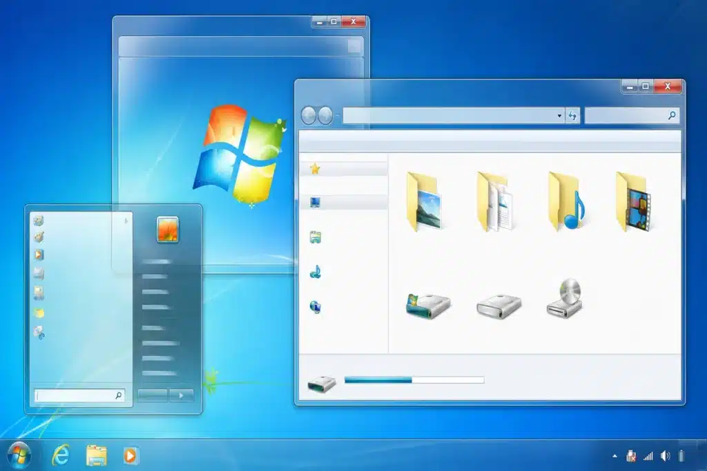
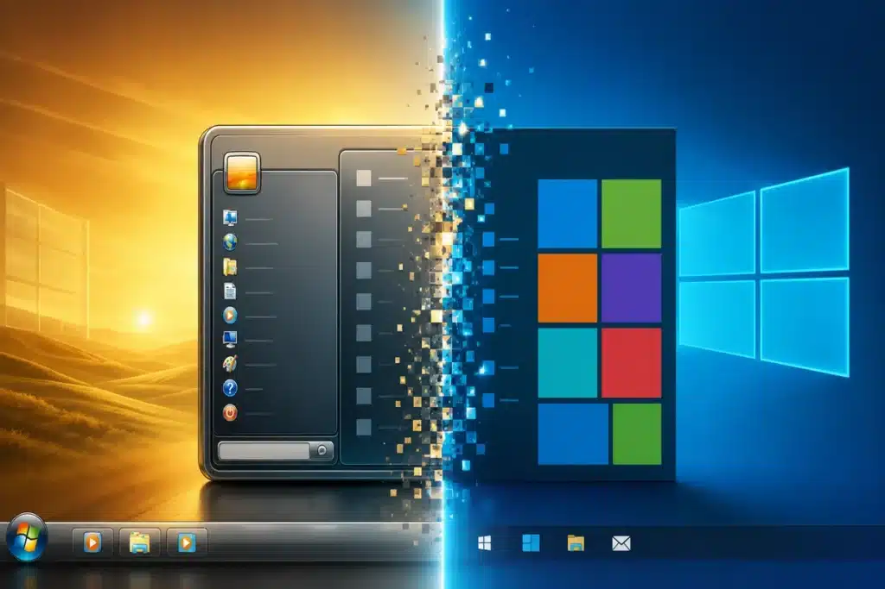
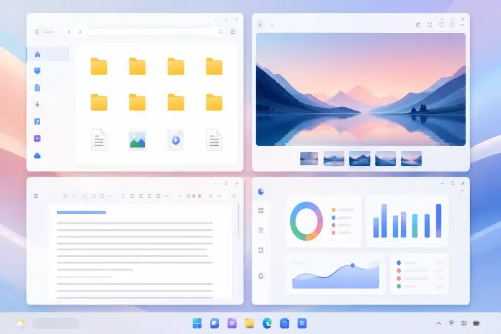

Primeiramente, estudar o **sistema operacional Windows** para concursos exige reconhecer as diferenças entre Windows 7, Windows 10 e Windows 11. As bancas costumam cobrar elementos da interface, configurações, recursos de produtividade, segurança, gerenciamento de arquivos e datas de encerramento do suporte.

Além disso, uma questão pode apresentar uma imagem da Área de Trabalho, citar um recurso do Menu Iniciar ou afirmar que determinada versão ainda recebe atualizações. Por isso, você precisa entender a evolução visual e funcional de cada versão para não cair em pegadinhas na hora da prova.

Aqui você verá os pontos que mais aparecem nas provas, as datas oficiais de suporte e os detalhes que costumam confundir o candidato.

### Sistema operacional Windows: o que mais cai em concursos?

Inicialmente, vale entender o conceito por trás do nome. O sistema operacional Windows é desenvolvido pela Microsoft e gerencia o hardware do computador, permite executar programas, organizar dados, criar usuários e oferecer uma interface gráfica para interação com o equipamento.

Em provas de informática, os temas mais recorrentes sobre o sistema operacional Windows são:

-   Área de Trabalho
-   Ícones, atalhos e janelas
-   Menu Iniciar
-   Barra de Tarefas
-   Explorador de Arquivos
-   Lixeira
-   Painel de Controle
-   Aplicativo Configurações
-   Atualizações e segurança
-   [Arquivos, pastas e extensões](/informatica-concursos-gerenciamento-arquivos-pastas/)
-   Recursos de multitarefa

Vale destacar que você precisa saber identificar os nomes corretos dos recursos. Por exemplo, é comum a banca perguntar sobre a função da Lixeira, o uso da Barra de Tarefas ou o local para alterar configurações do sistema.

Além disso, dominar o sistema operacional Windows envolve entender a organização de documentos, diretórios e extensões. Para aprofundar esse conteúdo, consulte o guia de [gerenciamento de arquivos e pastas para concursos](/informatica-concursos-gerenciamento-arquivos-pastas/).

### Linha do tempo e suporte oficial

Antes de tudo, não confunda data de lançamento com fim do suporte. Quando uma versão do sistema operacional Windows deixa de receber suporte, o computador continua funcionando, mas a Microsoft para de enviar atualizações regulares de segurança, correções e suporte técnico.

| Sistema | Lançamento | Fim do suporte | Situação em 2026 | Destaque para provas |
| --- | --- | --- | --- | --- |
| Windows 7 | 22/10/2009 | 14/01/2020 | Sem suporte | Aero, Menu Iniciar clássico e Painel de Controle |
| Windows 10 | 29/07/2015 | 14/10/2025 | Sem suporte geral | Blocos dinâmicos, Central de Ações e Edge |
| Windows 11 | 05/10/2021 | Varia por versão e edição | Em suporte nas versões vigentes | Menu centralizado, Snap Layouts e TPM 2.0 |

O suporte estendido do Windows 7 terminou em 14 de janeiro de 2020. Depois dessa data, a Microsoft deixou de fornecer atualizações de segurança e suporte técnico regular para usuários domésticos dessa versão.

Na sequência, o suporte geral do [Windows 10](/windows-10-para-concursos/) chegou ao fim em 14 de outubro de 2025. A versão 22H2 marcou a última atualização de recursos para a linha tradicional do sistema.

Por outro lado, o Windows 11 não segue uma data única de encerramento para todo o sistema operacional. Cada edição tem prazo próprio: as versões Home e Pro recebem, normalmente, 24 meses de suporte, enquanto Enterprise e Education recebem 36 meses.

Guarde esta ideia: na sua prova, a banca pode explorar justamente essa diferença entre um sistema operacional Windows com prazo único e outro com prazos escalonados por edição.

Para confirmar prazos, políticas de atualização e ciclos de vida diretamente na fonte oficial, consulte a [página da Microsoft sobre suporte do Windows](https://learn.microsoft.com/pt-br/lifecycle/faq/windows).

## Windows 7: interface clássica e efeito Aero

Em primeiro lugar, o Windows 7 é associado a uma interface mais clássica desse sistema operacional Windows. Seu Menu Iniciar fica no canto inferior esquerdo da tela e é acessado por um botão circular com o logotipo do Windows.

Além disso, o principal destaque visual da versão é o Windows Aero. O recurso apresentava transparência nas bordas das janelas, animações, efeitos visuais e miniaturas de aplicativos na Barra de Tarefas.

Os elementos mais importantes dessa versão do sistema operacional Windows são:

-   Menu Iniciar tradicional
-   Barra de Tarefas com miniaturas das janelas abertas
-   Área de notificação, também chamada de bandeja do sistema
-   Windows Explorer para acessar arquivos e pastas
-   Bibliotecas, como Documentos, Imagens, Músicas e Vídeos
-   Gadgets de Área de Trabalho, como relógio e calendário
-   Painel de Controle como principal local de configurações

Vale ressaltar que o Windows 7 utiliza a denominação Windows Explorer. Nas versões posteriores do sistema operacional Windows, esse recurso passou a se chamar Explorador de Arquivos.

Por esse motivo, se a banca mencionar efeitos de transparência, janelas com aparência de vidro ou Gadgets na Área de Trabalho, a associação mais provável será com o Windows 7.

## Windows 10: transição entre o clássico e o moderno

Em seguida, o Windows 10 recuperou o Menu Iniciar que havia sido retirado do modelo padrão no Windows 8. Contudo, ele voltou com uma mudança importante: a presença dos blocos dinâmicos, também chamados de Live Tiles.

Dessa forma, o Menu Iniciar dessa versão do sistema operacional Windows combina uma lista de aplicativos com blocos que exibem informações atualizadas, como dados de calendário, clima, notícias, fotos e e-mails.

As principais mudanças do Windows 7 para o Windows 10 foram:

-   Retorno do Menu Iniciar com blocos dinâmicos
-   Introdução da Central de Ações
-   Aplicativo Configurações com maior destaque
-   Microsoft Edge como [navegador](/buscador-e-navegador/) padrão
-   Visão de Tarefas (Task View)
-   Áreas de trabalho virtuais
-   Cortana, assistente virtual introduzida no sistema
-   Integração ampliada com serviços da Microsoft

Além disso, a Central de Ações reúne notificações e atalhos rápidos. Você pode acessar recursos como Wi-Fi, Bluetooth, modo avião, brilho da tela e economia de bateria diretamente por ela.

Aqui está um ponto que merece atenção: uma pegadinha frequente afirma que o Windows 10 substituiu totalmente o Painel de Controle pelo aplicativo Configurações. Essa afirmação está errada. O sistema operacional Windows passou a priorizar o aplicativo Configurações, mas manteve o Painel de Controle disponível.

## Windows 11: interface renovada e produtividade

Posteriormente, o Windows 11 trouxe uma mudança visual significativa para esse sistema operacional Windows. O Menu Iniciar e os ícones da Barra de Tarefas ficaram centralizados por padrão, embora você possa alterar o alinhamento para a esquerda nas configurações.

Além disso, o Windows 11 removeu os blocos dinâmicos do Menu Iniciar. Em vez deles, a interface passou a exibir aplicativos fixados, recomendações e arquivos recentes.

| Recurso | Windows 10 | Windows 11 | Pegadinha de prova |
| --- | --- | --- | --- |
| Menu Iniciar | Alinhado à esquerda, com blocos dinâmicos | Centralizado por padrão, sem blocos dinâmicos | Windows 11 não utiliza Live Tiles |
| Barra de Tarefas | Ícones à esquerda por padrão | Ícones centralizados por padrão | O alinhamento pode ser alterado pelo usuário |
| Janelas | Visual mais reto e tradicional | Cantos arredondados e novo design | Cantos arredondados remetem ao Windows 11 |
| Multitarefa | Encaixe de janelas e áreas virtuais | Snap Layouts e Snap Groups | Snap Layouts é recurso associado ao Windows 11 |
| Configurações rápidas | Central de Ações | Notificações e ajustes rápidos reorganizados | Não confundir as interfaces das duas versões |

Principalmente, o Windows 11 trouxe os Snap Layouts, que permitem organizar várias janelas em modelos predefinidos de tela. O recurso é voltado à produtividade e à multitarefa.

Da mesma forma, os Snap Groups ajudam você a retornar a grupos de aplicativos usados em conjunto. O sistema também preserva recursos como Visão de Tarefas e áreas de trabalho virtuais.

Para revisar os recursos cobrados nas versões atuais desse sistema operacional Windows, acesse também o conteúdo sobre [guia completo de Windows 10 para concursos](/windows-10-para-concursos/).

### Segurança e requisitos do Windows 11

Vale destacar que o Windows 11 exige requisitos de hardware mais rígidos que os das versões anteriores. Entre os mais conhecidos estão o TPM 2.0 e a Inicialização Segura, chamada de Secure Boot.

Em outras palavras, o TPM é um componente voltado à segurança. Ele auxilia na proteção de chaves criptográficas, credenciais e dados do sistema.

Por isso, se uma questão relacionar TPM 2.0 e Windows 11, a afirmação tende a estar correta. Por outro lado, afirmar que o Windows 7 exigia TPM 2.0 para instalação é incorreto.

### Pegadinhas sobre o sistema operacional Windows

Antes de finalizar, revise estas afirmações:

-   “O Windows 7 ainda recebe atualizações regulares de segurança.” Errado. O suporte terminou em 14 de janeiro de 2020.
-   “O Windows 10 teve o suporte geral encerrado em 14 de outubro de 2025.” Certo.
-   “O fim do suporte impede o computador de funcionar.” Errado. O sistema continua funcionando, mas deixa de receber atualizações e suporte regulares.
-   “O Menu Iniciar do Windows 10 pode exibir blocos dinâmicos.” Certo.
-   “O Menu Iniciar do Windows 11 mantém os Live Tiles do Windows 10.” Errado.
-   “No Windows 11, os ícones da Barra de Tarefas ficam centralizados por padrão.” Certo.
-   “Snap Layouts são recursos para organizar janelas.” Certo.
-   “O Painel de Controle foi removido completamente do Windows 10.” Errado.
-   “Todo Windows 11 possui a mesma data de fim de suporte.” Errado. O ciclo depende da versão e da edição.

Por fim, a prática com questões é a forma mais eficiente de consolidar diferenças de interface, recursos e atalhos entre as versões desse sistema operacional Windows. Resolva o [simulado de Windows 10 e 11 com questões comentadas no estilo Cebraspe](/simulado-sistemas/) e identifique os pontos que exigem nova revisão.

### Resumo para memorizar

Em síntese, o Windows 7 representa a interface clássica desse sistema operacional Windows, com Menu Iniciar tradicional, efeito Aero, Gadgets e forte presença do Painel de Controle. Seu suporte terminou em 2020.

Já o Windows 10 reúne elementos clássicos e modernos. Seus destaques incluem Menu Iniciar com blocos dinâmicos, Central de Ações, Microsoft Edge, Visão de Tarefas e áreas de trabalho virtuais. O suporte geral terminou em 14 de outubro de 2025.

Portanto, o Windows 11 trouxe Menu Iniciar centralizado, ausência de blocos dinâmicos, cantos arredondados, Snap Layouts e requisitos de segurança mais rigorosos. Ao estudar o sistema operacional Windows, memorize as datas de suporte, as mudanças visuais e os recursos que distinguem cada versão.

## Fontes e referências

-   [Microsoft Learn — Ciclo de vida do Windows 7](https://learn.microsoft.com/pt-br/lifecycle/products/windows-7)
-   [Microsoft Support — O que significa o Windows não ter mais suporte](https://support.microsoft.com/pt-br/windows/deployment/updates-lifecycle/what-does-it-mean-if-windows-isn-t-supported)
-   [Microsoft Support — Fim do suporte do Windows 10](https://support.microsoft.com/pt-br/windows/windows-10-suporte-terminou-a-14-de-outubro-de-2025-2ca8b313-1946-43d3-b55c-2b95b107f281)
-   [Microsoft Learn — Informações de versão do Windows 11](https://learn.microsoft.com/en-us/windows/release-health/windows11-release-information)
-   [Microsoft Learn — Planejamento para Windows 11](https://learn.microsoft.com/en-us/windows/whats-new/windows-11-plan)
-   [Microsoft — Novidades do Windows 11](https://www.microsoft.com/en-us/windows/learning-center/whats-new-in-windows-11)

-   
    
    [Cebraspe: como funciona a banca e o que ela cobra em Informática](/cebraspe-como-funciona-a-banca-e-o-que-ela-cobra-em-informatica/)
-   
    
    [Como Estudar para Concurso Faltando Menos de 15 Dias para a Prova](/como-estudar-para-concurso/)
-   
    
    [Informática para concursos: 5 confusões clássicas e como a banca as cobra](/informatica-para-concursos-5-duvidas-prova/)
-   
    
    [10 dicas para gabaritar a prova de Informática da Cebraspe PM MA 2026](/informatica-cebraspe-pm-ma-2026/)
-   
    
    [Windows 10: Guia Completo para Concursos Públicos](/windows-10-para-concursos/)
