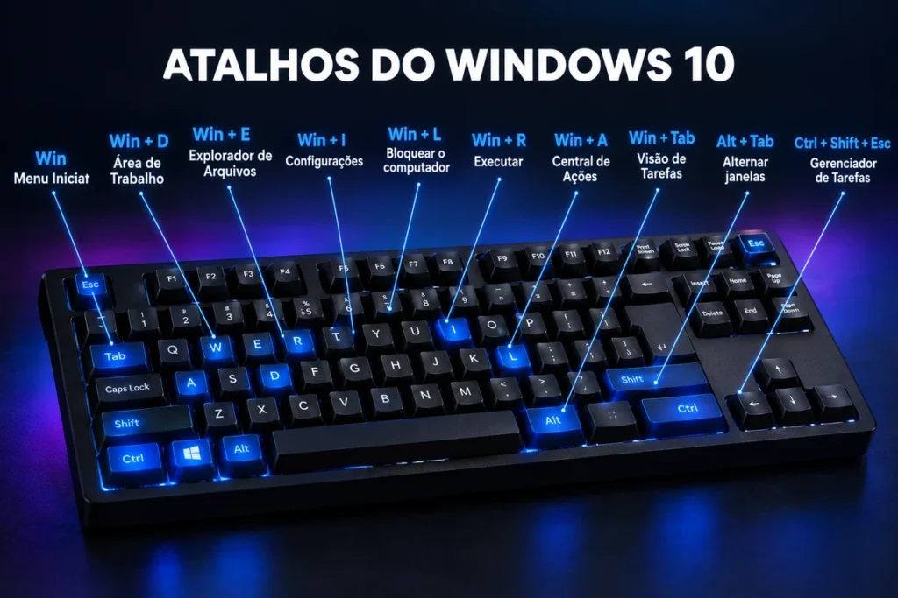
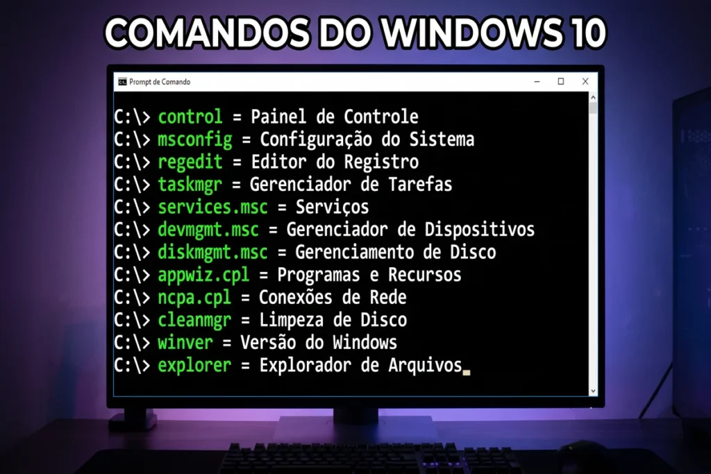

Primeiramente, o Windows 10 continua entre os assuntos mais cobrados em provas de Informática, mesmo depois do fim do suporte geral. As bancas seguem usando o sistema porque ele reúne quase tudo que o edital pede: interface, configurações, arquivos, segurança e atalhos.

Além disso, uma questão raramente pede apenas a definição de um recurso. Ela apresenta uma situação, mistura dois nomes parecidos e testa se você reconhece o correto. Por isso, este guia mostra o Windows 10 do jeito que ele aparece na sua prova. Se você quer a visão comparada das três versões, estude também o conteúdo sobre o [sistema Windows 7, 10 e 11 para concursos](/sistema-windows-7-10-11-para-concursos/).

Aqui você vai estudar o Menu Iniciar, a Central de Ações, a diferença entre Configurações e Painel de Controle, os atalhos, os comandos e o ciclo de suporte. No final, você resolve 10 questões no estilo Cebraspe para testar o que aprendeu.

**\[IMAGEM 1: introdução\]** Arquivo: concurseiro-estudando-windows-10.webp Alt: Concurseiro estudando Windows 10 em seu quarto com livros e anotações Legenda: O Windows 10 aparece em muitas questões de Informática, mesmo após o fim do suporte.

## Windows 10 no contexto dos concursos

Inicialmente, a Microsoft lançou o Windows 10 em julho de 2015 e o manteve como sistema principal por quase uma década. Consequentemente, ele domina o acervo de questões antigas e recentes das principais bancas.

Contudo, o edital nem sempre cita a versão. Muitas vezes pede apenas “Windows”, dentro do bloco de [noções de informática](/nocoes-de-informatica/), e a banca escolhe a versão que quiser. Quando a questão traz uma imagem da tela, o Windows 10 aparece com frequência.

Aqui está um ponto que merece atenção: a banca cobra o Windows 10 em três frentes.

-   **Reconhecimento:** você identifica o nome e a função de cada recurso.
-   **Comparação:** você diferencia o Windows 10 do Windows 7 e do Windows 11.
-   **Situação prática:** você aplica atalhos, comandos e caminhos de configuração.

## Menu Iniciar e blocos dinâmicos no Windows 10

Em primeiro lugar, o Windows 10 trouxe de volta o Menu Iniciar. O Windows 8 havia retirado o menu tradicional, e a mudança incomodou muita gente. Então a Microsoft devolveu o menu com uma novidade importante.

O novo Menu Iniciar combina duas áreas. À esquerda, ficam a lista de aplicativos e os botões de Usuário, Configurações e Energia. À direita, ficam os blocos dinâmicos, também chamados de Live Tiles.

Esses blocos exibem informações atualizadas sem que você abra o aplicativo. Eles podem mostrar:

-   Calendário e compromissos
-   Previsão do tempo
-   Notícias
-   Fotos
-   E-mails

Além disso, você pode mover, redimensionar, agrupar e desafixar cada bloco.

Na prova, a banca pode explorar justamente essa diferença: os blocos dinâmicos existem no Windows 10, mas o Windows 11 os removeu. Guarde esta ideia.

## Central de Ações: notificações e atalhos rápidos

Na sequência, o Windows 10 apresentou a Central de Ações. Ela fica no canto inferior direito da tela, na área de notificação, e você a abre com o atalho Win + A.

A Central reúne dois tipos de conteúdo: as notificações dos aplicativos e os botões de ação rápida. Entre esses botões, os mais cobrados são:

-   Wi-Fi
-   Bluetooth
-   Modo avião
-   Economia de bateria
-   Assistente de foco
-   Brilho da tela

Por outro lado, não confunda a Central de Ações com o aplicativo Configurações. A Central oferece atalhos para ajustes simples e imediatos. Já as Configurações permitem alterar o sistema de forma completa.

## Configurações x Painel de Controle no Windows 10

Esse é um detalhe que costuma confundir o candidato. O Windows 10 passou a priorizar o aplicativo Configurações, mas manteve o Painel de Controle. Os dois convivem no sistema.

⚙️ Configurações x Painel de Controle no Windows 10

Os dois convivem no sistema, mas cada um tem um papel diferente na prova.

| Aspecto | 🔵 Configurações | 🟣 Painel de Controle |
| --- | --- | --- |
| Como abrir | ⌨️`Win + I` | ⌨️Comando `control` |
| Visual | Moderno, organizado por categorias e cartões | Clássico, com ícones e categorias antigas |
| Introduzido em | Windows 8, ampliado no Windows 10 | Versões antigas do Windows (Windows 95) |
| Categorias principais | Sistema, Dispositivos, Rede, Contas, Atualização e Segurança | Programas, Rede, Hardware e Som, Contas de Usuário |
| Recurso exclusivo | Windows Update e Segurança do Windows | Ferramentas administrativas avançadas |
| Papel no Windows 10 | Recebe os ajustes novos  
Prioridade da Microsoft | Continua disponível  
Mantido por compatibilidade |
| Pegadinha de prova | ❌ “O Windows 10 removeu o Painel de Controle.” **Errado.** Os dois convivem no sistema. |

Nas Configurações, você encontra categorias como Sistema, Dispositivos, Rede e Internet, Personalização, Aplicativos, Contas, Hora e Idioma, Privacidade e Atualização e Segurança.

Vale destacar a última categoria. Em Atualização e Segurança ficam o Windows Update e a Segurança do Windows, recurso que reúne a proteção contra vírus e o firewall.

Portanto, se a banca afirmar que o Painel de Controle desapareceu do Windows 10, marque como errado.

## Visão de Tarefas e áreas de trabalho virtuais

Dando continuidade, o Windows 10 ampliou os recursos de multitarefa. O principal deles é a Visão de Tarefas, que você abre com Win + Tab.

Ela mostra miniaturas de todas as janelas abertas e permite criar áreas de trabalho virtuais. Cada área funciona como uma Área de Trabalho separada, com seus próprios aplicativos. Assim, você organiza estudo, trabalho e lazer sem misturar janelas.

Os atalhos das áreas virtuais aparecem com frequência em prova:

-   **Win + Ctrl + D:** cria uma nova área de trabalho virtual
-   **Win + Ctrl + F4:** fecha a área atual
-   **Win + Ctrl + setas:** alterna entre as áreas

É aqui que aparece uma das principais pegadinhas: Alt + Tab não abre a Visão de Tarefas. Ele apenas alterna entre as janelas abertas.

## Explorador de Arquivos e organização de dados

Em seguida, vale observar o gerenciador de arquivos. O Windows 7 usava o nome Windows Explorer. O Windows 10 usa Explorador de Arquivos, e você o abre com Win + E.

Por padrão, o Explorador abre na área Acesso rápido, que lista as pastas frequentes e os arquivos recentes. No painel lateral, você também encontra Este Computador, que no Windows 7 se chamava simplesmente Computador, e o OneDrive, o serviço de armazenamento em nuvem da Microsoft.

Além disso, o Explorador usa a Faixa de Opções, com guias como Arquivo, Início, Compartilhar e Exibir.

Outro ponto recorrente envolve a Lixeira. Quando você exclui um arquivo, o Windows o envia para a Lixeira, e dali ele pode voltar ao local original. Já Shift + Delete exclui o arquivo de forma permanente, sem passar por ela.

## Microsoft Edge e o fim do Internet Explorer

Antes de tudo, o Windows 10 estreou o Microsoft Edge como navegador padrão. Ele assumiu o lugar do Internet Explorer, que dominou o Windows por anos.

Nas primeiras versões, o Edge usava um mecanismo próprio da Microsoft. Depois, a empresa o reconstruiu sobre o Chromium, a base que o Google Chrome também utiliza. Por isso, o Edge atual tem aparência e recursos semelhantes aos dos navegadores modernos.

Por outro lado, o Internet Explorer 11 permaneceu no Windows 10 por um tempo, para manter a compatibilidade com sites antigos. A Microsoft encerrou o suporte a ele em 15 de junho de 2022, na maior parte das versões do Windows 10.

Na prova, a afirmação “o Edge é o navegador padrão do Windows 10” tende a estar correta.

## Cortana e integração com serviços Microsoft

Além disso, o Windows 10 incluiu a Cortana, uma assistente virtual que respondia a comandos de voz e de texto. Ela criava lembretes, fazia pesquisas e abria aplicativos. Depois, a Microsoft reduziu o papel da Cortana e encerrou o aplicativo no Windows em 2023.

Contudo, a integração do Windows 10 com os serviços da Microsoft continua importante para a prova. Entre os recursos mais cobrados, você encontra:

-   **Conta Microsoft:** sincroniza configurações e arquivos entre dispositivos
-   **OneDrive:** guarda arquivos na nuvem
-   **Windows Hello:** autentica o usuário por rosto, digital ou PIN
-   **Segurança do Windows:** oferece antivírus e firewall
-   **BitLocker:** criptografa o disco, principalmente nas edições Pro e Enterprise

## Principais atalhos do Windows 10

Agora chegamos a um dos temas que mais rendem pontos. Os atalhos aparecem em questões diretas e também em situações práticas. Memorize os da imagem abaixo.

Além dos dez atalhos da imagem, quatro outros costumam cair:

-   **Win + X:** abre o menu de links rápidos, com Gerenciador de Dispositivos, Gerenciamento de Disco e outros
-   **Win + V:** abre o Histórico da Área de Transferência
-   **Win + Shift + S:** captura uma parte da tela
-   **Win + Ctrl + D:** cria uma nova área de trabalho virtual

Na prática, a confusão acontece entre atalhos parecidos. Veja os pares que a banca mais mistura:

-   **Win + L** bloqueia o computador. **Win + R** abre o Executar.
-   **Win + E** abre o Explorador de Arquivos. **Win + A** abre a Central de Ações.
-   **Alt + Tab** alterna janelas. **Win + Tab** abre a Visão de Tarefas.

## Principais comandos do Windows 10

Por sua vez, os comandos também rendem questões. Você digita esses comandos na janela Executar, que abre com Win + R.

Na imagem, os comandos aparecem em uma janela de terminal para facilitar a leitura. Você pode digitá-los tanto no Executar quanto no Prompt de Comando.

### Executar x Prompt de Comando

Aqui está um detalhe que a banca explora. O Executar abre programas, pastas e recursos a partir do nome. O Prompt de Comando (cmd) interpreta comandos de texto e exibe o resultado na própria janela.

Os comandos que só fazem sentido no Prompt de Comando merecem uma revisão à parte:

-   `dir`: lista arquivos e pastas
-   `cd`: muda de diretório
-   `cls`: limpa a tela
-   `ipconfig`: mostra a configuração de rede
-   `ping`: testa a conexão com outro computador
-   `tasklist` e `taskkill`: listam e encerram processos
-   `chkdsk`: verifica erros no disco
-   `sfc /scannow`: repara arquivos do sistema

Não apenas isso: a banca costuma colocar comandos do Windows ao lado de comandos do Linux na mesma questão, como `dir` e `ls`, ou `cls` e `clear`. Para não cair nessa troca, estude também o conteúdo de [Linux para concursos](/linux-para-concursos/).

Portanto, se a questão trocar o msconfig pelo regedit, ou o control pelo cmd, desconfie. Cada comando abre uma ferramenta específica.

## Ciclo de suporte do Windows 10

Por fim, chegamos às datas. O suporte geral do Windows 10 terminou em 14 de outubro de 2025. A versão 22H2 foi a última atualização de recursos da linha tradicional do sistema.

Depois dessa data, o Windows 10 deixou de receber atualizações regulares de segurança, correções e suporte técnico. Em outras palavras, o computador continua funcionando, mas fica mais exposto a falhas e ataques. A Microsoft também criou um programa opcional de Atualizações de Segurança Estendidas (ESU), para quem precisava de mais tempo de transição.

Por isso, guarde a regra: fim de suporte não significa que o sistema para de funcionar.

Para conferir prazos e políticas direto na fonte, consulte a [página da Microsoft sobre o ciclo de vida do Windows](https://learn.microsoft.com/pt-br/lifecycle/faq/windows).

### Windows 10 x Windows 7: principais diferenças

Como resultado, a banca adora comparar as duas versões. Este quadro resume o que muda.

🖥️ Windows 10 x Windows 7: principais diferenças

Comparativo direto, ponto a ponto, dos itens mais cobrados em prova.

| Aspecto | 🟡 Windows 7 | 🔵 Windows 10 |
| --- | --- | --- |
| Menu Iniciar | Tradicional | Lista de aplicativos e blocos dinâmicos |
| Navegador padrão | Internet Explorer | Microsoft Edge |
| Notificações | Área de notificação simples | Central de Ações (Win + A) |
| Gerenciador de arquivos | Windows Explorer | Explorador de Arquivos |
| Configurações | Só Painel de Controle | Configurações + Painel de Controle |
| Áreas de trabalho virtuais | ✗ Não possui | ✓ Possui |
| Gadgets de Área de Trabalho | ✓ Possui | ✗ Não possui |
| Assistente virtual | ✗ Não possui | Cortana Descontinuada em 2023 |
| Requisito de TPM 2.0 | ✗ Não exigia | ✗ Não exige |
| Fim do suporte | 14/01/2020 Encerrado | 14/10/2025 Encerrado |

## Pegadinhas mais cobradas sobre o Windows 10

Antes de resolver as questões, revise estas afirmações:

-   “O Windows 10 removeu o Painel de Controle.” Errado. Ele convive com as Configurações.
-   “O Menu Iniciar do Windows 10 pode exibir blocos dinâmicos.” Certo.
-   “Win + L abre o Executar.” Errado. Ele bloqueia o computador.
-   “Alt + Tab abre a Visão de Tarefas.” Errado. Ele alterna entre janelas.
-   “A Central de Ações reúne notificações e botões de ação rápida.” Certo.
-   “O Edge é o navegador padrão do Windows 10.” Certo.
-   “Sem suporte, o Windows 10 deixa de funcionar.” Errado. Ele funciona, mas sem atualizações regulares.
-   “O Windows 10 chama o gerenciador de arquivos de Windows Explorer.” Errado. O nome é Explorador de Arquivos.
-   “O msconfig abre o Editor do Registro.” Errado. O comando do Registro é regedit.
-   “O Windows 10 usa Gadgets na Área de Trabalho.” Errado. Os Gadgets marcam o Windows 7.

## Conclusão

Em síntese, o Windows 10 reúne os pontos que a banca mais gosta de cobrar: Menu Iniciar com blocos dinâmicos, Central de Ações, Configurações convivendo com o Painel de Controle, Visão de Tarefas, Edge como navegador padrão e o fim do suporte em 14 de outubro de 2025.

Além disso, os atalhos e os comandos funcionam como pontos fáceis de conquistar, desde que você não troque um pelo outro. Releia os pares parecidos antes da prova.

Agora, o próximo passo é praticar. Resolva as questões abaixo e, depois, compare o Windows 10 com as outras versões no guia do [sistema Windows 7, 10 e 11 para concursos](/sistema-windows-7-10-11-para-concursos/). Essa comparação é o que mais evita erro na hora da prova.

### Questões de Certo ou Errado: Windows 10

Marque Certo ou Errado e confira o gabarito comentado logo abaixo de cada questão.

CEBRASPEQuestão 1

O Windows 10 trouxe de volta o Menu Iniciar retirado do modelo padrão no Windows 8, agora com blocos dinâmicos (Live Tiles) que podem exibir informações atualizadas.

CERTOERRADO

**Gabarito: CERTO.** O menu voltou com a lista de aplicativos e os blocos dinâmicos.

CEBRASPEQuestão 2

No Windows 10, o aplicativo Configurações substituiu totalmente o Painel de Controle, que deixou de existir no sistema.

CERTOERRADO

**Gabarito: ERRADO.** As Configurações ganharam destaque, mas o Painel de Controle continua disponível.

CEBRASPEQuestão 3

A Central de Ações do Windows 10 reúne notificações e botões de ação rápida, como Wi-Fi, Bluetooth e Modo avião.

CERTOERRADO

**Gabarito: CERTO.** Esse é o papel da Central de Ações, que você abre com Win + A.

CEBRASPEQuestão 4

No Windows 10, o atalho Win + L abre a janela Executar.

CERTOERRADO

**Gabarito: ERRADO.** Win + L bloqueia o computador. O Executar abre com Win + R.

CEBRASPEQuestão 5

A Visão de Tarefas, acessada por Win + Tab, permite gerenciar janelas abertas e criar áreas de trabalho virtuais.

CERTOERRADO

**Gabarito: CERTO.** A Visão de Tarefas reúne esses dois recursos de multitarefa.

CEBRASPEQuestão 6

Após o fim do suporte geral do Windows 10, em 14 de outubro de 2025, os computadores com esse sistema deixam de funcionar.

CERTOERRADO

**Gabarito: ERRADO.** O sistema continua funcionando, mas deixa de receber atualizações regulares de segurança.

CEBRASPEQuestão 7

Na janela Executar, o comando msconfig abre o Editor do Registro do Windows.

CERTOERRADO

**Gabarito: ERRADO.** O msconfig abre a Configuração do Sistema. O Editor do Registro usa o comando regedit.

CEBRASPEQuestão 8

O Microsoft Edge passou a ser o navegador padrão do Windows 10, no lugar do Internet Explorer.

CERTOERRADO

**Gabarito: CERTO.** O Edge estreou com o Windows 10 como navegador padrão.

CEBRASPEQuestão 9

O Gerenciador de Tarefas do Windows 10 pode ser aberto diretamente pelo atalho Ctrl + Shift + Esc.

CERTOERRADO

**Gabarito: CERTO.** Esse atalho abre o Gerenciador de Tarefas sem passar por menus.

CEBRASPEQuestão 10

O Windows 10 mantém a denominação Windows Explorer para o gerenciador de arquivos, exatamente como no Windows 7.

CERTOERRADO

**Gabarito: ERRADO.** No Windows 10, o nome é Explorador de Arquivos.

Seu desempenho: 0 de 0 acertos

## Perguntas frequentes sobre o Windows 10

### **O Windows 10 ainda cai em concursos?**

_Sim. Mesmo após o fim do suporte geral, as bancas continuam cobrando o Windows 10, principalmente em questões de interface, atalhos, configurações e comparação com o Windows 7 e o Windows 11._

### **Qual a diferença entre Configurações e Painel de Controle?**

_As Configurações (Win + I) têm visual moderno e recebem os ajustes novos. O Painel de Controle (comando control) tem visual clássico e continua disponível. Os dois convivem no Windows 10._

### **O Windows 10 ainda recebe atualizações?**

_O suporte geral terminou em 14 de outubro de 2025, então ele não recebe mais atualizações regulares de segurança. O sistema continua funcionando, e a Microsoft criou um programa opcional de atualizações estendidas para quem precisava de mais tempo._

### **Qual atalho abre a Central de Ações no Windows 10?**

_O atalho é Win + A. Não confunda com Win + E, que abre o Explorador de Arquivos, nem com Win + I, que abre as Configurações._

### **Qual comando abre o Painel de Controle?**

_Digite control na janela Executar (Win + R) ou no Prompt de Comando._

### **O Windows 10 tem blocos dinâmicos (Live Tiles)?**

_Sim. Os blocos dinâmicos fazem parte do Menu Iniciar do Windows 10. O Windows 11 os removeu._

## Fontes e Referências

-   Microsoft Learn. [Perguntas frequentes sobre o ciclo de vida do Windows](https://learn.microsoft.com/pt-br/lifecycle/faq/windows)
-   Microsoft Learn. [Ciclo de vida do Windows 10 Home e Pro](https://learn.microsoft.com/pt-br/lifecycle/products/windows-10-home-and-pro)
-   Microsoft Learn. [Perguntas frequentes sobre o Internet Explorer e o Microsoft Edge](https://learn.microsoft.com/pt-br/lifecycle/faq/internet-explorer-microsoft-edge)
-   Suporte da Microsoft. [Atalhos de teclado no Windows](https://support.microsoft.com/pt-br/windows/atalhos-de-teclado-no-windows-dcc61a57-8ff0-cffe-9796-cb9706c75eec)

-   
    
    [Cebraspe: como funciona a banca e o que ela cobra em Informática](/cebraspe-como-funciona-a-banca-e-o-que-ela-cobra-em-informatica/)
-   
    
    [Como Estudar para Concurso Faltando Menos de 15 Dias para a Prova](/como-estudar-para-concurso/)
-   
    
    [Informática para concursos: 5 confusões clássicas e como a banca as cobra](/informatica-para-concursos-5-duvidas-prova/)
-   
    
    [10 dicas para gabaritar a prova de Informática da Cebraspe PM MA 2026](/informatica-cebraspe-pm-ma-2026/)
-   
    
    [Windows 10: Guia Completo para Concursos Públicos](/windows-10-para-concursos/)
